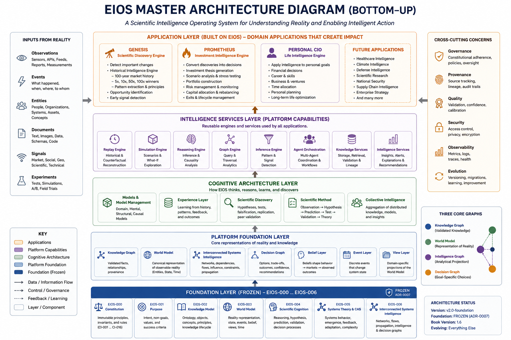

# EIOS Architecture Book

## Preface

> This manuscript is the single architectural source of truth for EIOS.
> Claude Code SHALL derive the contents of the `specification/` directory from this manuscript.

## Book Status

| Field | Value |
|-------|-------|
| Version | 3.5 |
| Status | Canonical Source |
| Authoritative | Yes |
| Target Generator | Claude Code |

## Master Architecture Diagram



A bottom-up view of the platform: the frozen Foundation (EIOS-000 … EIOS-006), the Platform Foundation and Cognitive Architecture layers, the Intelligence Services engines, and the Application layer (Genesis, Prometheus, Personal CIO). Maintained as a living reference artifact alongside the Book; it is not frozen.

## Glossary

This is the **Architectural Lexicon** of EIOS: every first-class architectural concept, defined exactly once. Chapters reference these definitions rather than redefining them. These definitions are normative. The **Status** column uses the Chapter Class taxonomy; **Canonical** names the chapter (or invariant) that owns the definition. ID namespaces (CI, FI, AR, REQ-*) are catalogued in the Book's Namespace Registry.

| Concept | Definition | Canonical | Related | Status |
|---------|------------|-----------|---------|--------|
| Reality | The external world; exists independently of EIOS and is only ever represented, never stored. | EIOS-002 | Observation, World Model | Foundational |
| Observation | A raw, immutable perception of reality with no inherent truth value. | EIOS-002 | Evidence, Fact | Foundational |
| Evidence | An Observation that has passed validation and carries provenance. | EIOS-002 | Observation, Fact | Foundational |
| Fact | A validated assertion supported by one or more Evidence objects. | EIOS-002 | Evidence, Knowledge Object | Foundational |
| Knowledge Object | The canonical unit of persistent knowledge; one per persistent concept, carrying provenance, versioning, confidence, and temporal history. | EIOS-002 | Knowledge Graph, Relationship | Foundational |
| Concept | An abstract idea that participates in reasoning but has no physical existence (e.g. scarcity, network effects); reusable across domains. | EIOS-002 | Principle, Knowledge Object | Foundational |
| Principle | A reusable explanatory mechanism describing recurring system behavior (e.g. Moore's Law); a first-class reasoning object. | EIOS-002 | Concept, Scientific Cognition | Foundational |
| Relationship | A first-class interaction between participants, carrying type, direction, confidence, and provenance. | EIOS-002 | Knowledge Object, Network | Foundational |
| Knowledge Graph | The complete collection of Knowledge Objects and Relationships; the persistent memory of EIOS. | EIOS-002 | World Model, Intelligence Graph | Foundational |
| Research Question | The unit that opens a scientific investigation; progresses through a defined lifecycle. | EIOS-004 | Hypothesis, Scientific Cognition | Foundational |
| Hypothesis | A competing explanation maintained with independent evidence, confidence, and replay history; contradictions preserved. | EIOS-002 | Research Question, Confidence | Foundational |
| Confidence | The current scientific belief in an object or relationship; evolves continuously and is never silently overridden. | EIOS-002 | Evidence, Replay | Foundational |
| Scientific Cognition | The architectural process turning knowledge into understanding: curiosity, mental modeling, inquiry, judgment, evolution. | EIOS-004 | Mental Model, Research Question | Foundational |
| Mental Model | A temporary, domain-specific reasoning context derived from and synchronized with the World Model; never an independent source of truth. | EIOS-004 | World Model, Scientific Cognition | Foundational |
| Model | A bounded, purpose-specific representation of part of reality, built to support explanation, prediction, simulation, reasoning, or decision; never reality itself. | EIOS-007 | Mental Model, World Model | Cognitive Architecture |
| Replay | Historical replay: scientific re-validation against a point-in-time reconstruction of the world; a precondition of production. | EIOS-000 (CI-008) | Confidence, FI-002 | Constitutional |
| Experience Layer | The institutional memory of scientific understanding — validated models, reasoning strategies, replay outcomes, lessons learned — that turns accumulated experience into reusable institutional intelligence. | EIOS-008 | Scientific Memory, Institutional Intelligence | Cognitive Architecture |
| Institutional Intelligence | The collective scientific capability accumulated through continuous experience; unlike memory, it actively improves reasoning (analogy, pattern recognition, principle extraction, strategy selection). | EIOS-008 | Experience Layer, Scientific Memory | Cognitive Architecture |
| System State | A real-world system's condition as a multidimensional state vector (readiness, constraint, dependency, confidence, evolution, transition), not a scalar; estimated continuously by the Experience Layer. | EIOS-008 | Readiness, Experience Layer | Cognitive Architecture |
| Readiness | The degree to which a system holds the prerequisites for a future transition; an extensible multidimensional vector (not a scalar), with momentum (direction of change) tracked separately. | EIOS-008 | System State, Constraint Release | Cognitive Architecture |
| Constraint Release | The reduction or elimination of limiting conditions that previously blocked system evolution; often precedes major transitions; tracked independently of readiness (measured by CRI). | EIOS-008 | Constraint, Readiness | Cognitive Architecture |
| Convergence | The simultaneous satisfaction of multiple independently evolving readiness dimensions; major transitions emerge from convergence rather than any single condition (measured by CAS). | EIOS-008 | Readiness, Emergence Readiness Score | Cognitive Architecture |
| Emergence Readiness Score | The headline architectural assessment (ERS) of how prepared a system appears for significant transition; an architectural concept, not a prescribed algorithm — one of six (ERS, RM, CRI, CAS, HAS, TTI). | EIOS-008 | Readiness, Convergence | Cognitive Architecture |
| Historical Scientific Intelligence | The Experience Layer capability that extracts enduring, reusable scientific understanding from historical reality — cases, transitions, successes, and failures — rather than merely recording history. | EIOS-008 | Historical Case, Scientific Principle | Cognitive Architecture |
| Historical Case | A bounded, replayable observation of reality over a defined period, preserving its full scientific context; the unit from which scientific principles are extracted. | EIOS-008 | Historical Scientific Intelligence, Scientific Principle | Cognitive Architecture |
| Scientific Principle | A Principle (EIOS-002) generalized from recurring mechanisms across multiple independent Historical Cases; preserves supporting cases, evidence, models, confidence, applicability, and limits; continuously re-evaluable. | EIOS-008 | Principle, Candidate Scientific Law | Cognitive Architecture |
| Candidate Scientific Law | A Scientific Principle showing persistent validity across many domains and long history, proposed with stronger evidence for validation. Experience proposes; Scientific Discovery validates. | EIOS-008 | Scientific Principle | Cognitive Architecture |
| Institutional Scientific Learning | The Experience Layer capability that turns accumulated scientific experience into enduring organizational intelligence — consolidation, confidence evolution, conflict preservation, maturity, continuity — so every validated discovery permanently improves future reasoning. | EIOS-008 | Institutional Intelligence, Institutional Wisdom | Cognitive Architecture |
| Institutional Wisdom | The highest level of accumulated scientific understanding, emerging from long-term integration of validated experience, principles, candidate laws, and organizational learning; evidence-based and distinguished from opinion. | EIOS-008 | Institutional Scientific Learning, Scientific Principle | Cognitive Architecture |
| Knowledge Consolidation | Combining related scientific understanding into coherent institutional knowledge while preserving provenance, uncertainty, and competing explanations; never discards contradictory evidence. | EIOS-008 | Institutional Scientific Learning | Cognitive Architecture |
| Knowledge Maturity | The progressive stages (emerging → developing → validated → established → foundational) through which an institutional knowledge artifact advances; evolves independently per artifact and is continuously reassessable. | EIOS-008 | Institutional Scientific Learning | Cognitive Architecture |
| World Model | The continuously evolving cognitive representation of reality built from the Knowledge Graph; the primary product and sole authoritative representation of reality. | EIOS-003 | Knowledge Graph, Intelligence Graph | Foundational |
| World Model View | A persistent projection of the World Model optimized for a class of investigations; derived from and subordinate to the World Model. | EIOS-003 | World Model | Foundational |
| Event | A discrete occurrence that modifies system state; distinct from state (state is what exists, an event is what caused change). | EIOS-003 | World Model | Foundational |
| Belief | A held conviction that may diverge from observed reality yet influences behavior; represented independently of objective reality. | EIOS-003 | World Model, Reality | Foundational |
| Economic System | A primary system within which organizations, governments, markets, technologies, and companies participate; never analyzed in isolation. | EIOS-005 (CI-013) | System Dynamics, Network | Foundational |
| System Dynamics | The interconnected behavior of reality's systems that must be considered together. | EIOS-003, EIOS-005 | Propagation, Emergence | Foundational |
| Causal Relationship | A relationship expressing why a change occurs, kept distinct from statistical correlation. | EIOS-003 (CI-004) | Relationship, Propagation | Foundational |
| Emergence | Behavior arising from interaction among many participants, not attributable to any individual; a property of systems. | EIOS-005 | System Dynamics, Network | Foundational |
| Propagation | How a change in one part of a system influences others over time (origin, direction, magnitude, delay, amplification). | EIOS-005 | Bottleneck, Leverage Point | Foundational |
| Constraint | A factor that regulates propagation or limits a system; represented explicitly. | EIOS-005 | Bottleneck, Propagation | Foundational |
| Bottleneck | A constraint that limits system throughput; its removal reorganizes the whole system, so it receives elevated priority. | EIOS-005 | Constraint, Leverage Point | Foundational |
| Leverage Point | A location where a small change produces disproportionately large downstream effects. | EIOS-005 | Propagation, Bottleneck | Foundational |
| Network | A first-class analytical structure of nodes, relationships, flows, dependencies, and constraints; participants belong to many at once. | EIOS-006 | Intelligence Graph, Relationship | Foundational |
| Intelligence Graph | A dynamic analytical projection assembled from interconnected networks to answer a class of questions; derived from the World Model, not a replacement for it. | EIOS-006 | World Model, Decision Graph | Foundational |
| Decision Graph | A transient, goal-specific projection of feasible choices, consequences, trade-offs, and recommendations, derived exclusively from the Intelligence Graph; never a canonical representation of reality. | EIOS-006 | Intelligence Graph | Foundational |
| Model Graph | The first-class graph of relationships among models — inheritance, specialization, composition, dependency, validation, refinement; the primary primitive for reasoning about models. The Model Registry is an index over it. | EIOS-007 | Model, Intelligence Graph | Cognitive Architecture |
| Model Repository | The store of model definitions, implementations, artifacts, and historical versions; distinct from the Model Registry (the index) and the Model Graph (the relationships). | EIOS-007 | Model Graph, Model Registry | Cognitive Architecture |
| Model Portfolio | A purpose-specific collection of cooperating models assembled for a reasoning objective; more than a set of models — a reusable reasoning strategy whose effectiveness the Experience Layer learns over time. | EIOS-007 | Model, Model Graph | Cognitive Architecture |
| Scientific Memory | The accumulated body of validated models, reasoning strategies, validation history, replay outcomes, and lessons learned; grows without rewriting history and is a primary input to future discovery — the bridge to the Experience Layer. | EIOS-007 | Model Portfolio, Experience Layer | Cognitive Architecture |
| Genesis | Operational subsystem that discovers transformations in real-world systems rather than searching directly for securities. | EIOS-001 | Prometheus, Personal CIO | Operational |
| Prometheus | Operational subsystem that evaluates the implications of validated knowledge for publicly traded entities. | EIOS-001 | Genesis, Personal CIO | Operational |
| Personal CIO | Operational subsystem that explains causal chains, quantifies uncertainty, and retains human accountability for recommendations. | EIOS-001 | Genesis, Prometheus | Operational |

---

## Namespace Registry

Every architectural identifier belongs to exactly one namespace. New namespaces SHALL be registered here.

| Namespace | Meaning | Canonical Source | Example |
|-----------|---------|------------------|---------|
| CI | Constitutional Invariant | EIOS-000 (frozen; ADR-0006) | CI-008 Historical Replay Before Production |
| FI | Foundational Principle (implements constitutional invariants) | EIOS-001 | FI-002 Replay-Driven Scientific Validation |
| AR | Architectural Rule | EIOS-002 … EIOS-008 | AR-0609 Intelligence Graph derives from World Model |
| REQ-KO | Requirement — Knowledge Objects | EIOS-002 | REQ-KO-002 Provenance Tracking |
| REQ-SC | Requirement — Scientific Cognition | EIOS-004 | REQ-SC-008 Scientific Judgment |
| REQ-ST | Requirement — Systems Theory | EIOS-005 | REQ-ST-015 Bottleneck Analysis |
| REQ-ISI | Requirement — Interconnected Systems Intelligence | EIOS-006 | REQ-ISI-011 Decision Graph Representation |
| REQ-MD | Requirement — Models & Model Management | EIOS-007 | REQ-MD-005 Uncertainty Representation |
| REQ-EX | Requirement — Experience Layer | EIOS-008 | REQ-EX-007 Emergence Intelligence |

---

<!-- BOOK-METADATA
book_id: EIOS
version: 3.5
authoritative: true
target_generator: Claude Code
-->

# PART I — FOUNDATION

<!-- BEGIN:PART:FOUNDATION -->

> **Foundation Status: Release 2.0 — Frozen (ADR-0007).** Chapters EIOS-000 through EIOS-006 are architecturally stable; changes require a new ADR, not a manuscript patch. This freeze covers the Foundation chapters only — appendices, reference material, and later Parts continue to evolve.

## CHAPTER EIOS-000 — Constitution of EIOS

<!-- SLUG: constitution -->

<!-- BEGIN:CHAPTER:EIOS-000 -->

**Chapter Class:** Constitutional

### 1. Purpose of this Part

This Part establishes the constitutional foundation of the Economic Intelligence Operating System (EIOS).

Unlike traditional software documentation, this Part does not describe implementation.

It defines immutable architectural law.

Every subsystem of EIOS—including the Kernel, World Model, Genesis, Prometheus, Personal CIO, Engineering Framework, and every future capability—shall conform to the principles established in this Part.

No subsequent architecture may contradict the Constitution without an Architecture Decision Record explicitly superseding the affected constitutional rule.

---

### 2. The Purpose of EIOS

The purpose of EIOS is not to predict stock prices.

The purpose of EIOS is not to outperform a benchmark.

The purpose of EIOS is not to automate investment decisions.

The purpose of EIOS is to continuously construct the most accurate computational representation of economic reality possible.

Investment intelligence is merely one application of that representation.

This distinction is fundamental.

Traditional investment systems optimize directly for investment outputs.

EIOS optimizes for the quality of its understanding of reality.

Improved investment decisions emerge naturally from improved understanding.

Therefore:

**Reality is the primary product.**

Investment recommendations are secondary products.

---

### 3. Mission

The mission of EIOS is to continuously observe reality, acquire evidence, construct knowledge, discover causal relationships, maintain a living world model, generate scientific understanding, and transform that understanding into explainable economic intelligence.

---

### 4. Vision

EIOS seeks to become the world's most accurate computational model of technological and economic evolution.

The platform shall continuously answer questions such as:

What is changing?

Why is it changing?

How quickly is it changing?

What systems are affected?

Who benefits?

Who is disrupted?

What second-order effects emerge?

What third-order effects emerge?

Which public companies are positioned to benefit?

What evidence supports that conclusion?

How certain is the conclusion?

What evidence would invalidate it?

---

### 5. Constitutional Invariants

The following constitutional invariants (CI) hold across all future versions of EIOS. A constitutional invariant may be changed only by an Architecture Decision Record that explicitly supersedes it.

#### CI-001 — Reality Exists Independently of EIOS

Reality is never created by software.

Reality is merely observed.

Every internal representation maintained by EIOS is therefore an approximation of reality.

The objective of the platform is to minimize approximation error over time.

#### CI-002 — Reality Precedes Models

Reality

↓

Observation

↓

Evidence

↓

Knowledge

↓

Scientific Understanding

↓

Economic Intelligence

↓

Investment Intelligence

No architectural component may reverse this ordering.

#### CI-003 — Knowledge Precedes Recommendation

Recommendations shall never be generated directly from observations.

Every recommendation shall be traceable to validated knowledge.

Every knowledge statement shall be traceable to supporting evidence.

Every evidence item shall be traceable to one or more observations.

#### CI-004 — Causality Precedes Correlation

Statistical correlation may generate hypotheses.

Statistical correlation shall never constitute proof.

Every production recommendation shall ultimately be supported by explicit causal reasoning.

#### CI-005 — Knowledge is Versioned

Knowledge changes.

Economic laws evolve.

Technology evolves.

Supply chains evolve.

Every Knowledge Object therefore possesses a complete version history.

Historical versions are never destroyed.

#### CI-006 — Every Conclusion is Explainable

Every conclusion generated by EIOS shall expose:

Origin.

Evidence.

Reasoning chain.

Confidence.

Assumptions.

Alternative hypotheses.

Invalidation criteria.

No opaque recommendation may enter production.

#### CI-007 — Scientific Humility

EIOS never claims certainty.

Every model represents the current best explanation of available evidence.

New evidence shall always be capable of modifying previous conclusions.

#### CI-008 — Historical Replay Before Production

No model, hypothesis, investment thesis, recommendation, portfolio allocation, or autonomous decision may enter production without successful historical replay against representative historical data.

Replay is not a software testing activity.

Replay is a scientific validation activity.

Failure during replay invalidates the promotion request until corrected.

This invariant applies to every reasoning subsystem without exception.

#### CI-009 — Experience is a First-Class Asset

The platform shall continuously learn from history.

Past successes.

Past failures.

Missed opportunities.

Incorrect hypotheses.

Unexpected outcomes.

Experience shall itself become structured knowledge.

#### CI-010 — The World Model is the Primary Product

Companies are not the primary objects of EIOS.

Stocks are not the primary objects.

Markets are not the primary objects.

The World Model is the primary product.

Every other capability derives from it.

#### CI-011 — Investment Intelligence is an Emergent Property

Investment theses shall emerge from:

Reality

↓

Knowledge

↓

World Model

↓

Scientific Reasoning

↓

Economic Intelligence

↓

Investment Intelligence

No subsystem shall optimize directly for stock selection without traversing this chain.

#### CI-012 — Human Oversight

EIOS augments human judgment.

It does not replace accountability.

Architectural decisions, constitutional changes, and production governance remain human responsibilities.

#### CI-013 — Economic Systems Are Primary

Economic systems are primary.

Organizations, governments, markets, technologies, and companies are participants within those systems.

No subsystem shall analyze an individual participant independently of the larger systems in which it operates.

#### CI-014 — Knowledge Objects Carry Provenance

Every Knowledge Object shall record its provenance.

The origin of every observation, the evidence supporting every fact, and the reasoning producing every conclusion shall be retained and inspectable.

Knowledge without provenance is inadmissible.

#### CI-015 — Models Are Provisional

Reality is continuously evolving.

Therefore every model maintained by EIOS SHALL be considered provisional.

Continuous observation and model revision are constitutional responsibilities of the platform.

#### CI-016 — No Single Reasoning Engine Is Authoritative

No single reasoning engine is authoritative.

Scientific conclusions emerge through the synthesis of independent evidence, competing hypotheses, replay, causal analysis, and experience.

No individual algorithm, model, AI agent, or heuristic may be considered the authoritative source of truth.

---

### 6. Constitutional Invariant Register

| ID | Invariant |
|--------|-----------|
| CI-001 | Reality exists independently of EIOS. |
| CI-002 | Reality precedes models. |
| CI-003 | Knowledge precedes recommendation. |
| CI-004 | Causality precedes correlation. |
| CI-005 | Knowledge is versioned. |
| CI-006 | Every conclusion is explainable. |
| CI-007 | Scientific humility. |
| CI-008 | Historical replay before production. |
| CI-009 | Experience is a first-class asset. |
| CI-010 | The World Model is the primary product. |
| CI-011 | Investment intelligence is an emergent property. |
| CI-012 | Human oversight. |
| CI-013 | Economic systems are primary; participants are analyzed within them. |
| CI-014 | Knowledge Objects carry provenance. |
| CI-015 | Models are provisional; reality evolves continuously. |
| CI-016 | No single reasoning engine is authoritative. |

---

### 7. Normative Status

The Constitution is normative.

If any subsequent chapter conflicts with the Constitution, the Constitution prevails.

Such conflicts SHALL be resolved by an Architecture Decision Record before implementation proceeds.

---

### 8. Constitution Status

Status: Stable.

The Constitution is frozen as of CI-016.

Future modifications to the Constitution SHALL be made through an Architecture Decision Record that explicitly supersedes the affected invariant. The Constitution SHALL NOT be amended by manuscript patch. Amending the Constitution is a governance action equivalent to amending a charter.

---

### Cross References

- **Defines:** CI-001 … CI-016
- **Referenced By:** ALL chapters
- **Conforms To:** _(not applicable — this chapter is the root constitution)_
- **See Also:** _(none yet)_

<!-- END:CHAPTER:EIOS-000 -->

## CHAPTER EIOS-001 — Purpose

<!-- SLUG: purpose -->

<!-- BEGIN:CHAPTER:EIOS-001 -->

**Chapter Class:** Foundational

### 1.1 Introduction

The Economic Intelligence Operating System (EIOS) is founded on a simple observation:

> Financial markets are not primary phenomena.
> They are emergent phenomena.

Every movement in a security price is the consequence of changes occurring elsewhere. Those changes begin in the physical world, propagate through scientific discovery, technological innovation, industrial production, logistics, regulation, demographics, capital allocation, corporate strategy, and only then become visible in financial markets.

Traditional investment systems reverse this causal chain. They begin with securities, search for historical statistical relationships, and attempt to extrapolate future returns.

EIOS rejects this methodology.

The objective of EIOS is not to predict prices directly.

Its objective is to continuously construct the most accurate representation of economic reality possible and allow investment conclusions to emerge naturally from that representation.

Investment intelligence is therefore an emergent property of scientific reasoning rather than an optimization objective.

---

### 1.2 Why Existing Investment Systems Fail

Modern investment systems generally fall into one of five categories.

#### Statistical Systems

These systems search historical price series for recurring mathematical patterns.

They assume that sufficiently complex statistical models can discover persistent predictive relationships.

Their principal weakness is that correlation is frequently mistaken for causation.

When the underlying economic system changes, statistical relationships often disappear.

---

#### Fundamental Research Systems

These systems analyze companies individually.

Revenue growth.

Margins.

Cash flow.

Competitive positioning.

While these approaches produce valuable insights, they begin too late in the causal chain.

By the time a company's financial statements improve, the underlying technological or economic transformation has often been underway for years.

---

#### Quantitative Factor Systems

These systems identify common characteristics among historical outperformers.

Value.

Momentum.

Quality.

Low volatility.

Size.

The factors themselves are descriptive rather than explanatory.

They describe what happened.

They do not explain why.

---

#### Artificial Intelligence Chat Systems

Large Language Models summarize information remarkably well.

They answer questions.

Generate reports.

Explain concepts.

However, they generally lack persistent scientific memory, explicit causal models, continuously evolving world representations, and rigorous provenance.

Consequently, they are excellent assistants but poor scientific reasoning engines.

---

#### Human Experts

Domain experts possess deep intuition acquired through years of experience.

Their principal limitation is scale.

No individual can simultaneously monitor global technology development, supply chains, macroeconomics, geopolitics, regulation, venture funding, corporate execution, scientific publications, and financial markets in real time.

---

### 1.3 Design Objective

EIOS does not attempt to outperform these systems by doing the same work faster.

Instead it changes the starting point.

Instead of beginning with:

Companies

EIOS begins with:

Reality.

The design objective can therefore be stated formally.

**Objective 1**

Construct and continuously maintain an internally consistent computational model of observable economic reality.

**Objective 2**

Continuously discover durable causal relationships within that model.

**Objective 3**

Generate investment intelligence only after sufficient supporting evidence exists.

---

### 1.4 First Architectural Principle

#### Reality Before Representation

Reality exists independently of EIOS.

The purpose of EIOS is not to create reality.

It is to approximate reality with increasing accuracy.

Every internal model maintained by EIOS therefore represents a hypothesis regarding the external world.

Models are never treated as facts.

They are continuously revised as new evidence becomes available.

This principle establishes an important invariant.

**Architectural Invariant FI-001**

No internal representation may be considered authoritative merely because it exists inside EIOS.

Authority derives only from supporting evidence.

---

### 1.5 Second Architectural Principle

#### Knowledge is Constructed

Information is not knowledge.

Raw observations become knowledge only after they satisfy explicit validation criteria.

For this reason EIOS distinguishes between:

* Observation
* Evidence
* Information
* Knowledge
* Scientific Principle
* Economic Law

Each represents a progressively stronger level of confidence.

The transformation between these stages constitutes one of the core responsibilities of the operating system.

---

### 1.6 The Knowledge Pipeline

Every conclusion generated by EIOS shall be traceable through the following reasoning pipeline.

Observation

↓

Evidence

↓

Validated Fact

↓

Knowledge Object

↓

Relationship

↓

Knowledge Graph

↓

World Model

↓

Scientific Hypothesis

↓

Economic Principle

↓

Economic Law

↓

Investment Thesis

↓

Portfolio Decision

Each transition requires additional evidence.

No transition may bypass intermediate stages.

This guarantees explainability and replayability.

---

### 1.7 Third Architectural Principle

#### Replay-Driven Scientific Validation

Reality is not static, and neither is knowledge. Every conclusion EIOS reaches is reached on the basis of what was known at a particular moment.

For a conclusion to be trustworthy it must be reproducible. It must be possible to reconstruct the world as it was known at the time, replay the exact evidence, models, and parameters that produced the conclusion, and obtain the same result.

Replay-driven validation is how the Purpose layer realizes Constitutional Invariant CI-008 (Historical Replay Before Production). The Constitution establishes the invariant; this principle explains why it matters and how reasoning honors it. It is not a testing convenience and it is not a diagnostic afterthought; it is a precondition of production.

**Foundational Principle FI-002 — Replay-Driven Scientific Validation**

No reasoning output may be promoted to production unless it can be regenerated end to end by replaying, against a point-in-time reconstruction of the world as it was then known, the exact evidence, models, and parameters that produced it.

A conclusion that cannot be replayed is treated as non-existent for all production purposes.

This principle implements CI-008 and SHALL NOT be read as an independent or competing definition of replay.

---

### 1.8 Architectural Consequences

The principles established in this chapter have far-reaching implications for every subsystem.

Genesis will not search directly for stocks.

Instead, it will discover transformations occurring in technology, infrastructure, demographics, energy, manufacturing, regulation, capital formation, and other real-world systems.

Prometheus will not rank securities based solely on statistical characteristics.

Instead, it will evaluate the implications of validated economic knowledge for publicly traded entities.

The Personal CIO will not merely recommend transactions.

It will explain the complete causal chain leading from observed reality to each recommendation, quantify uncertainty at every stage, identify assumptions, and update conclusions as new evidence becomes available.

These responsibilities are consequences of the architectural principles established here rather than independent product features.

---

### 1.9 Non-Goals

The following capabilities are explicitly outside the architectural purpose of EIOS.

EIOS is NOT:

* a stock screener
* a trading algorithm
* a portfolio optimizer
* an LLM wrapper
* a chatbot
* a rule engine
* a reporting dashboard
* a relational database
* a business intelligence tool

These capabilities may exist as applications constructed upon EIOS, but SHALL NOT define the architecture itself.

---

### Cross References

- **Conforms To:** EIOS-000
- **Defines:** FI-001, FI-002
- **Related Chapters:** _(none yet)_
- **Referenced By:** _(none yet)_
- **See Also:** _(none yet)_

<!-- END:CHAPTER:EIOS-001 -->

## CHAPTER EIOS-002 — Reality, Observation, Evidence, and Knowledge

<!-- SLUG: knowledge-model -->

<!-- BEGIN:CHAPTER:EIOS-002 -->

**Chapter Class:** Foundational

### Purpose

This chapter defines the epistemological model of EIOS.

Where the Constitution establishes the immutable governing principles of the platform, this chapter defines **how EIOS acquires, validates, represents, and evolves knowledge**.

Every subsystem—including the World Model, Genesis, Prometheus, Personal CIO, Replay Engine, and future reasoning systems—shall conform to the knowledge model established herein.

---

### Conformance

This chapter SHALL conform to:

* EIOS-000 — Constitution of EIOS
* EIOS-001 — Purpose of EIOS

In particular, this chapter operationalizes the Constitutional Invariants concerning:

* Reality before representation.
* Knowledge before recommendation.
* Explainability.
* Historical replay.
* Provenance.
* Continuous learning.

No rule in this chapter may contradict the Constitution.

---

### The Epistemological Pipeline

EIOS constructs understanding through the following immutable progression.

```text
Reality
    ↓
Observation
    ↓
Evidence
    ↓
Fact
    ↓
Knowledge Object
    ↓
Knowledge Graph
    ↓
World Model
    ↓
Scientific Hypothesis
    ↓
Economic Principle
    ↓
Investment Thesis
    ↓
Decision
```

Every transition represents an increase in semantic value rather than merely additional data.

No stage may be skipped.

---

### Reality

Reality exists independently of EIOS.

Reality is never stored.

Reality is only represented.

Consequently every internal representation maintained by EIOS possesses approximation error.

The purpose of the platform is therefore continuous approximation improvement rather than static correctness.

---

### Observation

An Observation represents a raw perception of reality.

Observations possess no inherent truth value.

Typical observation sources include:

* Scientific publications
* SEC filings
* Patent databases
* Satellite imagery
* Earnings calls
* Government releases
* Sensor networks
* Internal research
* Financial exchanges
* Human analysts
* AI agents

Observations SHALL remain immutable after ingestion.

Corrections SHALL be represented as subsequent observations.

---

### Evidence

Evidence consists of observations that have passed validation.

Validation SHALL include:

* Source authenticity
* Temporal verification
* Integrity checking
* Provenance
* Duplicate detection
* Consistency analysis

Evidence SHALL maintain links to every originating Observation.

Evidence SHALL NEVER exist without provenance.

---

### Facts

Facts represent validated assertions supported by one or more Evidence objects.

Facts differ from Knowledge Objects.

Facts describe individual statements.

Knowledge Objects represent persistent entities.

Example:

Fact

"NVIDIA announced Blackwell on DATE."

Knowledge Object

"NVIDIA Corporation"

Facts may expire.

Knowledge Objects evolve.

---

### Knowledge Objects

Knowledge Objects constitute the canonical persistence model of EIOS.

Every persistent concept SHALL be represented as exactly one Knowledge Object type.

Future domains SHALL extend the ontology rather than introducing parallel persistence models.

---

### Canonical Object Categories

Persistent Knowledge Objects include the following canonical categories:

* Entity
* Relationship
* Observation
* Evidence
* Fact
* Knowledge Object
* Research Question
* Hypothesis
* Prediction
* Decision
* Experience
* Simulation
* Scenario
* Concept
* Principle
* Constraint
* Opportunity
* Policy

Future chapters SHALL reference these canonical object definitions rather than redefining them.

---

### Concept Objects

Concepts represent abstract ideas that participate in reasoning but do not exist as physical entities.

Illustrative examples include:

* Inflation
* Scarcity
* Competition
* Network Effects
* Learning Curves
* Comparative Advantage
* Optionality
* Platform Effects
* Economies of Scale

Concepts SHALL be reusable across multiple domains.

---

### Principle Objects

Principles represent reusable explanatory mechanisms that describe recurring behavior within systems.

Illustrative examples include:

* Moore's Law
* Wright's Law
* Metcalfe's Law
* Jevons Paradox
* Pareto Principle
* Comparative Advantage
* Experience Curves

Principles SHALL be first-class reasoning objects.

Scientific cognition SHALL reason with principles rather than merely storing them.

---

### Canonical Structure of a Knowledge Object

Every Knowledge Object SHALL contain at minimum:

* Object Identifier
* Canonical Name
* Object Type
* Version Identifier
* Lifecycle State
* Confidence
* Provenance Chain
* Supporting Evidence
* Contradicting Evidence
* Relationships
* Temporal Validity
* Historical Lineage
* Responsible Agent
* Last Verification
* Replay Status

Additional attributes MAY be defined by specialized object types.

The canonical structure SHALL remain backward compatible.

---

### Provenance

Every Knowledge Object SHALL expose complete provenance.

At any time the system SHALL answer:

* Where did this originate?
* Which observations support it?
* Which evidence validated it?
* Which reasoning produced it?
* Which hypotheses were rejected?
* Which downstream conclusions depend upon it?

Knowledge without provenance SHALL NOT enter the World Model.

---

### Confidence

Confidence represents the current scientific belief held by EIOS.

Confidence SHALL evolve continuously.

Confidence SHALL NOT be manually overridden except through explicitly recorded governance actions.

Confidence increases through:

* Independent corroboration
* Successful prediction
* Historical replay
* Expert validation
* Cross-source consistency

Confidence decreases through:

* Contradictory evidence
* Failed predictions
* Replay failures
* Source degradation
* Internal inconsistency

---

### Contradictory Knowledge

Contradictions SHALL be preserved.

EIOS SHALL support multiple competing hypotheses simultaneously.

Each hypothesis SHALL possess independent evidence, confidence, and replay history.

Resolution occurs through accumulation of evidence rather than deletion of alternatives.

---

### Temporal Knowledge

Knowledge exists through time.

Every Knowledge Object SHALL preserve:

* Historical State
* Current State
* Forecast State

Transitions between states SHALL themselves become historical events.

This enables replay, simulation, auditability, and causal analysis.

---

### Relationships

Relationships are first-class Knowledge Objects.

Relationships SHALL possess:

* Identifier
* Relationship Type
* Source Object
* Target Object
* Confidence
* Evidence
* Temporal Validity
* Strength
* Provenance

Examples include:

* Depends On
* Produces
* Consumes
* Enables
* Competes With
* Invests In
* Owns
* Manufactures
* Regulates
* Influences
* Accelerates
* Constrains

---

### Knowledge Graph

The complete collection of Knowledge Objects and Relationships forms the Knowledge Graph.

The Knowledge Graph is an implementation artifact.

The World Model is a reasoning artifact.

The two are related but not identical.

The World Model incorporates:

* Knowledge Graph
* Temporal reasoning
* Confidence propagation
* Causal relationships
* System dynamics
* Experience Layer

The World Model SHALL therefore be defined separately in Chapter EIOS-003.

---

### Canonical Definition Rule

Every architectural concept SHALL possess exactly one canonical definition.

Subsequent chapters SHALL reference that definition rather than redefining the concept.

This rule applies to:

* Object definitions
* Architectural constructs
* Graphs
* Cognitive concepts
* System concepts
* Reasoning concepts

This preserves architectural consistency as the platform evolves.

---

### Architectural Rules

- **AR-0201** — Every persistent concept SHALL be represented as a Knowledge Object.
- **AR-0202** — Every Knowledge Object SHALL possess complete provenance.
- **AR-0203** — Every Knowledge Object SHALL be versioned.
- **AR-0204** — Contradictory hypotheses SHALL be preserved.
- **AR-0205** — Relationships SHALL be first-class objects.
- **AR-0206** — Knowledge SHALL evolve temporally.
- **AR-0207** — Confidence SHALL evolve continuously.
- **AR-0208** — Recommendations SHALL reference Knowledge Objects rather than raw Evidence.
- **AR-0209** — Knowledge SHALL conform to all Constitutional Invariants defined in EIOS-000.

---

### Requirements Introduced

- **REQ-KO-001** — Canonical Knowledge Object
- **REQ-KO-002** — Provenance Tracking
- **REQ-KO-003** — Knowledge Versioning
- **REQ-KO-004** — Continuous Confidence Evolution
- **REQ-KO-005** — Relationship Ontology
- **REQ-KO-006** — Temporal Knowledge Representation
- **REQ-KO-007** — Contradiction Preservation
- **REQ-KO-008** — Knowledge Graph Construction
- **REQ-KO-009** — Epistemological Conformance

---

### Cross References

- **Conforms To:** EIOS-000
- **Builds Upon:** EIOS-001
- **Defines:** Knowledge Objects; Evidence Model; Provenance Model; Confidence Model; Knowledge Graph
- **Referenced By:** EIOS-003 — World Model; EIOS-004 — Computational Scientific Cognition; EIOS-008 — Experience Layer; GEN-001 — Genesis Discovery Engine; PROM-001 — Investment Thesis Engine; Personal CIO

<!-- END:CHAPTER:EIOS-002 -->

## CHAPTER EIOS-003 — The World Model

<!-- SLUG: world-model -->

<!-- BEGIN:CHAPTER:EIOS-003 -->

**Chapter Class:** Foundational

### Purpose

The purpose of this chapter is to define the World Model, the central cognitive representation maintained by EIOS.

The World Model is the primary product of the platform.

Every subsystem exists either to improve the World Model or to reason from it.

Investment intelligence is therefore an emergent consequence of maintaining an increasingly accurate World Model.

---

### Conformance

This chapter SHALL conform to:

* EIOS-000 — Constitution of EIOS
* EIOS-001 — Purpose of EIOS
* EIOS-002 — Reality, Observation, Evidence, and Knowledge

No subsystem may maintain an alternative authoritative representation of reality.

---

### Definition

The World Model is the continuously evolving computational representation of observable reality maintained by EIOS.

It integrates:

* Knowledge Objects
* Relationships
* Temporal history
* Causal structure
* Confidence propagation
* Competing hypotheses
* Experience
* Forecasts

The World Model is not a database.

The World Model is not a knowledge graph.

The World Model is a living scientific model.

The Knowledge Graph is the persistent memory of EIOS.

The World Model is the continuously evolving cognitive representation constructed from that memory.

Memory records what is known.

The World Model reasons about what those facts collectively imply.

---

### Architectural Role

The World Model serves six constitutional responsibilities.

1. Represent reality.
2. Explain reality.
3. Predict plausible future states.
4. Detect inconsistencies.
5. Support scientific reasoning.
6. Enable explainable decisions.

Every future subsystem SHALL use the World Model rather than constructing independent internal realities.

---

### Canonical Components

The World Model consists of the following logical layers.

#### Entity Layer

Represents persistent entities.

Examples:

* Companies
* Products
* Technologies
* Scientific discoveries
* Manufacturing facilities
* Governments
* Regulations
* People
* Universities
* Investment funds
* Natural resources
* Geographic regions
* Economic indicators

Every entity SHALL be represented as a Knowledge Object.

#### Relationship Layer

Represents how entities interact.

Relationships include:

* Ownership
* Competition
* Manufacturing
* Consumption
* Financing
* Regulation
* Dependency
* Influence
* Supply
* Demand
* Collaboration
* Geographic containment

Relationships SHALL themselves be Knowledge Objects.

#### Temporal Layer

The World Model never represents a single moment.

Every entity exists across time.

The platform SHALL preserve:

* Historical states
* Current state
* Expected future states
* Transition events

Historical information SHALL never be discarded.

#### Causal Layer

The Causal Layer explains why changes occur.

Examples include:

Technology adoption causes increased semiconductor demand.

Semiconductor shortages constrain AI infrastructure.

Energy prices influence manufacturing cost.

Interest-rate changes alter capital allocation.

The World Model SHALL distinguish causal relationships from statistical associations.

#### Confidence Layer

Every entity and relationship possesses confidence.

Confidence SHALL propagate through dependent reasoning.

Low-confidence knowledge SHALL never silently produce high-confidence conclusions.

Confidence propagation algorithms are defined in later chapters.

#### Hypothesis Layer

The World Model SHALL simultaneously support competing explanations.

Example:

Hypothesis A:

Battery demand accelerates due to EV adoption.

Hypothesis B:

Battery demand accelerates due to grid storage.

Both may coexist.

Confidence evolves independently.

Evidence continuously updates both hypotheses.

#### Experience Layer

Historical reasoning outcomes become part of the World Model.

Examples include:

Successful forecasts.

Failed forecasts.

Incorrect causal assumptions.

Unexpected technological adoption.

The Experience Layer continuously modifies future reasoning.

Detailed algorithms are defined in EIOS-005.

---

### World Model Evolution

The World Model is never static.

Every observation may trigger:

* Entity creation
* Entity update
* Relationship update
* Confidence adjustment
* Hypothesis creation
* Hypothesis retirement
* Forecast revision
* Causal graph refinement

Evolution SHALL preserve complete historical lineage.

---

### Multi-Scale Representation

Reality exists simultaneously at multiple scales.

The World Model SHALL represent at least:

Global

↓

Regional

↓

National

↓

Industry

↓

Company

↓

Business Unit

↓

Product

↓

Technology

↓

Component

↓

Material

↓

Process

↓

Physical Asset

Reasoning SHALL traverse scales bidirectionally.

Example:

Lithium mining

↓

Battery production

↓

EV manufacturing

↓

Automobile profitability

↓

Equity valuation

and

AI demand

↓

GPU shortages

↓

HBM demand

↓

Equipment suppliers

↓

Capital expenditure

↓

Macroeconomic investment.

---

### System Dynamics

Reality consists of interacting systems.

Examples include:

Technology

Economics

Energy

Manufacturing

Transportation

Healthcare

Defense

Agriculture

Climate

Education

Finance

These systems SHALL remain interconnected.

No subsystem may analyze an isolated participant without considering surrounding systems.

---

### State Transitions

Every entity occupies one or more states.

Examples:

Emerging

Growing

Mature

Declining

Obsolete

Transitions become historical events.

Transitions SHALL remain replayable.

---

### Forecast States

The World Model SHALL explicitly distinguish:

Observed Reality

Projected Reality

Alternative Futures

Counterfactual Futures

Only observed reality influences confidence directly.

Forecasts influence hypotheses.

---

### World Model Views

Views are persistent projections of the World Model optimized for a class of investigations.

Illustrative Views include:

* Technology View
* Scientific View
* Capital View
* Supply View
* Demand View
* Infrastructure View
* Resource View
* Policy View
* Risk View

Views remain derived from the World Model.

The World Model remains the single canonical representation of observable reality.

---

### Event Layer

Events represent discrete occurrences that modify one or more system states.

Illustrative events include:

* Patent granted
* Factory opened
* Factory destroyed
* Regulation enacted
* Acquisition completed
* Scientific breakthrough
* Product released

Events SHALL remain distinct from system state.

State describes what currently exists.

Events describe what caused change.

---

### Belief Layer

Reality and observed behavior frequently diverge.

The World Model SHALL distinguish:

Observed Reality

↓

Beliefs

↓

Behavior

↓

Observable Outcomes

Beliefs influence markets, policy, organizations, and individuals.

The architecture SHALL therefore represent beliefs independently of objective reality.

---

### Architectural Rules

- **AR-0301** — The World Model SHALL be the sole authoritative computational representation of reality.
- **AR-0302** — Every persistent entity SHALL exist within the World Model.
- **AR-0303** — Every entity SHALL possess temporal history.
- **AR-0304** — Every relationship SHALL possess provenance.
- **AR-0305** — The World Model SHALL preserve competing hypotheses.
- **AR-0306** — Historical states SHALL remain immutable.
- **AR-0307** — Forecast states SHALL never overwrite observed states.
- **AR-0308** — Causal structure SHALL remain distinct from statistical correlation.
- **AR-0309** — Experience SHALL continuously refine the World Model.
- **AR-0310** — Subsystems SHALL reason from the World Model rather than duplicating it.

---

### Requirements Introduced

- **REQ-WM-001** — Canonical World Model
- **REQ-WM-002** — Multi-Scale Representation
- **REQ-WM-003** — Temporal World State
- **REQ-WM-004** — Causal Layer
- **REQ-WM-005** — Confidence Propagation
- **REQ-WM-006** — Competing Hypotheses
- **REQ-WM-007** — Historical Replay Support
- **REQ-WM-008** — Forecast State Management
- **REQ-WM-009** — Experience Integration
- **REQ-WM-010** — System Dynamics

---

### Future Dependencies

This chapter is referenced by:

* EIOS-004 — Computational Scientific Cognition
* EIOS-008 — Experience Layer
* GEN-001 — Genesis Discovery Engine
* PROM-001 — Investment Thesis Engine
* Personal CIO
* Kernel Architecture
* Simulation Engine
* Replay Engine

---

### Cross References

- **Conforms To:** EIOS-000; EIOS-001; EIOS-002
- **Defines:** World Model; Canonical Entity Representation; Multi-Scale Reality; Causal Layer; Forecast States; System Dynamics
- **Referenced By:** All reasoning, forecasting, simulation, investment, and orchestration subsystems

<!-- END:CHAPTER:EIOS-003 -->

## CHAPTER EIOS-004 — Computational Scientific Cognition

<!-- SLUG: scientific-cognition -->

<!-- BEGIN:CHAPTER:EIOS-004 -->

**Chapter Class:** Foundational

### Purpose

The preceding chapters define the constitutional principles, knowledge architecture, and World Model of EIOS.

This chapter defines how EIOS transforms those assets into scientific thought.

Scientific cognition is the architectural process by which EIOS observes reality, develops curiosity, constructs mental models, formulates hypotheses, validates explanations, and continuously refines its understanding of the world.

Unlike traditional AI systems that optimize for answers, EIOS optimizes for understanding.

Understanding is never static.

Scientific cognition therefore represents a perpetual process rather than a terminal state.

---

### Conformance

This chapter SHALL conform to:

* EIOS-000 — Constitution of EIOS
* EIOS-001 — Purpose
* EIOS-002 — Knowledge Model
* EIOS-003 — World Model

This chapter introduces no new ontology.

Object definitions remain the responsibility of the Knowledge Model.

---

### The Cognitive Architecture

EIOS maintains five independent cognitive responsibilities.

1. Curiosity
2. Mental Modeling
3. Scientific Inquiry
4. Scientific Understanding
5. Knowledge Evolution

These responsibilities are distinct.

No subsystem SHALL collapse multiple responsibilities into a single implementation.

---

### The Cognitive Cycle

Scientific cognition SHALL continuously execute the following cycle.

```text
Reality
        ↓
Observation
        ↓
Evidence
        ↓
Knowledge Objects
        ↓
Knowledge Graph
        ↓
World Model
        ↓
Computational Curiosity
        ↓
Mental Models
        ↓
Scientific Inquiry
        ↓
Hypothesis Generation
        ↓
Prediction
        ↓
Historical Replay
        ↓
Scientific Understanding
        ↓
Knowledge Evolution
        ↓
World Model Refinement
        ↓
(repeat)
```

The architecture is cyclic rather than linear.

Every completed reasoning cycle improves future reasoning.

---

### Computational Curiosity

Curiosity is the initiating force of scientific cognition.

Unlike reactive software, EIOS SHALL proactively seek opportunities to improve its understanding of reality.

Curiosity continuously searches for:

* unexplained phenomena
* contradictory evidence
* missing relationships
* unexpected observations
* technological discontinuities
* scientific breakthroughs
* emerging bottlenecks
* structural economic changes
* abnormal market behavior
* unexpected company behavior
* violations of existing mental models

Curiosity generates opportunities for investigation.

It does not generate conclusions.

---

### Mental Models

Mental Models represent domain-specific abstractions constructed from the World Model.

The World Model remains authoritative.

Mental Models are temporary reasoning contexts.

A Mental Model highlights a subset of reality relevant to a particular investigation while preserving consistency with the complete World Model.

Examples include:

* Semiconductor Industry Model
* AI Infrastructure Model
* Power Grid Model
* Battery Ecosystem Model
* Pharmaceutical Innovation Model
* Capital Allocation Model
* Global Shipping Model
* Energy Transition Model

Mental Models SHALL never become independent sources of truth.

They SHALL continuously synchronize with the World Model.

---

### Scientific Inquiry

Scientific Inquiry transforms curiosity into structured investigation.

Every inquiry begins with one or more Research Questions.

Scientific Inquiry determines:

* what requires explanation
* what assumptions deserve testing
* what observations require additional evidence
* what causal mechanisms remain uncertain
* what predictions should be evaluated

Scientific Inquiry coordinates investigation.

It does not determine truth.

---

### Research Question Lifecycle

Research Questions progress through the following lifecycle.

1. Proposed
2. Accepted
3. Investigating
4. Hypothesis Formulation
5. Replay
6. Validated
7. Archived

Questions may return to earlier states when new evidence emerges.

Retired questions remain part of historical knowledge.

---

### Cognitive Context

Every investigation SHALL define a Cognitive Context.

The Cognitive Context identifies:

* active Mental Models
* participating Knowledge Objects
* relevant systems
* temporal scope
* geographic scope
* reasoning objectives
* assumptions
* constraints

Cognitive Context ensures that reasoning remains explainable and reproducible.

---

### Multi-Model Cognition

Complex investigations frequently require multiple Mental Models simultaneously.

Example:

AI Infrastructure Investigation

requires

* Semiconductor Model
* Power Infrastructure Model
* Capital Markets Model
* Supply Chain Model
* Geopolitical Model

Scientific cognition SHALL support concurrent reasoning across multiple Mental Models.

---

### Architectural Separation

The following concepts SHALL remain distinct.

- **Knowledge Graph** — persistent memory of validated knowledge.
- **World Model** — canonical representation of observable reality.
- **Mental Models** — context-specific abstractions for reasoning.
- **Scientific Inquiry** — the process of discovering unanswered questions.
- **Scientific Understanding** — the validated explanatory library.

Confusing these concepts results in architectural coupling and loss of explainability.

---

### Scientific Judgment

Scientific Judgment is the process by which EIOS evaluates competing explanations and determines the current best explanation for observed reality.

Judgment does not establish truth.

Judgment continuously estimates which explanation is presently most consistent with available evidence, historical replay, and accumulated experience.

Scientific Judgment integrates:

* Research Questions
* Mental Models
* Competing Hypotheses
* Evidence
* Causal Models
* Historical Replay
* Experience
* Confidence Evolution

Judgment SHALL remain provisional.

Every judgment remains subject to future revision.

---

### Goal-Directed Scientific Inquiry

Scientific Curiosity SHALL always operate in pursuit of explicit goals.

Goals provide direction.

Curiosity provides discovery.

Inquiry provides investigation.

Examples include:

* Discover emerging technologies.
* Detect future supply-chain bottlenecks.
* Explain unexpected market behavior.
* Identify structural economic transitions.
* Discover future investment opportunities.
* Detect changes in competitive advantage.
* Understand capital allocation shifts.

Goals SHALL remain independent from implementation.

Future applications may introduce additional goals without modifying the cognitive architecture.

---

### Reasoning Modes

Scientific cognition SHALL support multiple reasoning modes.

The architecture SHALL remain independent of any specific implementation.

Canonical reasoning modes include:

* Deductive Reasoning
* Inductive Reasoning
* Abductive Reasoning
* Analogical Reasoning
* Systems Reasoning
* Causal Reasoning
* Temporal Reasoning
* Counterfactual Reasoning
* Probabilistic Reasoning
* Constraint-Based Reasoning

Different investigations may employ different combinations of reasoning modes.

The architecture SHALL permit extension through future reasoning paradigms.

---

### Scientific Judgment Lifecycle

Every significant investigation SHALL progress through the following lifecycle.

```text
Scientific Inquiry
        ↓
Candidate Hypotheses
        ↓
Evidence Evaluation
        ↓
Causal Analysis
        ↓
Prediction
        ↓
Historical Replay
        ↓
Scientific Judgment
        ↓
Knowledge Evolution
        ↓
World Model Refinement
```

The lifecycle is iterative.

Completion of one investigation frequently generates additional investigations.

---

### Explainability

Every production conclusion SHALL possess a complete reasoning record.

Explainability consists of four independent traces.

#### Evidence Trace

Records:

* originating observations
* evidence
* provenance
* confidence evolution

#### Reasoning Trace

Records:

* Research Questions
* Mental Models
* reasoning modes
* hypotheses
* causal analysis

#### Replay Trace

Records:

* historical datasets
* replay configuration
* prediction accuracy
* failure analysis

#### Decision Trace

Records:

* final judgment
* alternatives considered
* rejected explanations
* confidence
* assumptions
* remaining uncertainty

Together these traces SHALL provide complete scientific transparency.

---

### Cognitive Integrity

Scientific cognition SHALL preserve its integrity under all operating conditions.

The platform SHALL NEVER:

* conceal uncertainty
* manufacture confidence
* discard contradictory evidence
* bypass provenance
* bypass historical replay
* collapse competing hypotheses prematurely
* overwrite historical knowledge

Scientific integrity takes precedence over computational convenience.

---

### Scientific Humility

Scientific understanding is never complete.

Every validated explanation remains provisional.

Every accepted hypothesis remains subject to revision.

Every mental model remains incomplete.

The architecture therefore prefers:

"I do not yet know."

over

"I know."

This principle encourages continuous inquiry rather than premature certainty.

---

### Meta-Cognition

Scientific cognition SHALL continuously evaluate its own reasoning.

Meta-cognition asks:

* Were the correct Research Questions investigated?
* Were the appropriate Mental Models selected?
* Were alternative hypotheses considered?
* Was replay sufficient?
* Were causal explanations complete?
* Should confidence change?
* Should future investigations receive higher priority?

Meta-cognition continuously improves future scientific investigations.

---

### Knowledge Evolution

Scientific Understanding evolves continuously.

Knowledge evolution includes:

* refinement
* expansion
* correction
* consolidation
* specialization
* abstraction

Evolution SHALL preserve complete historical lineage.

Earlier understanding SHALL remain replayable.

---

### Ontology Clarification

Research Questions, Hypotheses, Predictions, Decisions, Experiences, Concepts, and Principles SHALL be defined exclusively within EIOS-002 — Knowledge Model.

EIOS-004 defines their cognitive lifecycle rather than their structural representation.

Future chapters SHALL reference the canonical ontology defined by the Knowledge Model.

---

### Architectural Rules

- **AR-0401** — Scientific cognition SHALL begin with Computational Curiosity.
- **AR-0402** — Mental Models SHALL derive exclusively from the World Model.
- **AR-0403** — Mental Models SHALL never become authoritative sources of truth.
- **AR-0404** — Scientific Inquiry SHALL operate within an explicit Cognitive Context.
- **AR-0405** — Multiple Mental Models SHALL be supported simultaneously.
- **AR-0406** — Curiosity SHALL continuously search for anomalies and unanswered questions.
- **AR-0407** — Scientific Inquiry SHALL improve the World Model rather than bypass it.
- **AR-0408** — Scientific Judgment SHALL remain provisional.
- **AR-0409** — Scientific Curiosity SHALL operate in pursuit of explicit goals.
- **AR-0410** — Multiple reasoning modes SHALL be supported.
- **AR-0411** — Every production conclusion SHALL possess complete explainability.
- **AR-0412** — Scientific Integrity SHALL take precedence over computational convenience.
- **AR-0413** — Meta-cognition SHALL continuously improve future reasoning.
- **AR-0414** — Knowledge Evolution SHALL preserve historical lineage.
- **AR-0415** — Scientific Understanding SHALL continuously refine the World Model.

---

### Requirements Introduced

- **REQ-SC-001** — Computational Curiosity
- **REQ-SC-002** — Mental Model Framework
- **REQ-SC-003** — Cognitive Context
- **REQ-SC-004** — Scientific Inquiry Lifecycle
- **REQ-SC-005** — Multi-Model Cognition
- **REQ-SC-006** — World Model Synchronization
- **REQ-SC-007** — Architectural Separation
- **REQ-SC-008** — Scientific Judgment
- **REQ-SC-009** — Goal-Directed Inquiry
- **REQ-SC-010** — Multi-Modal Reasoning
- **REQ-SC-011** — Explainability Framework
- **REQ-SC-012** — Cognitive Integrity
- **REQ-SC-013** — Meta-Cognition
- **REQ-SC-014** — Knowledge Evolution
- **REQ-SC-015** — World Model Refinement

---

### Future Dependencies

This chapter is referenced by:

* EIOS-007 — Models and Model Management
* EIOS-008 — Experience Layer
* GEN-001 — Genesis Discovery Engine
* GEN-002 — Technology Intelligence Engine
* GEN-003 — Economic Intelligence Engine
* PROM-001 — Investment Thesis Engine
* PROM-002 — Portfolio Intelligence
* Personal CIO
* Replay Engine
* Simulation Engine
* Agent Orchestrator

---

### Cross References

- **Conforms To:** EIOS-000; EIOS-001; EIOS-002; EIOS-003
- **Defines:** Computational Curiosity; Mental Models; Scientific Inquiry; Cognitive Context; Multi-Model Cognition; Scientific Judgment; Goal-Directed Inquiry; Explainability; Cognitive Integrity; Meta-Cognition; Knowledge Evolution
- **Referenced By:** All reasoning, discovery, forecasting, simulation, replay, autonomous agent, and investment subsystems

<!-- END:CHAPTER:EIOS-004 -->

## CHAPTER EIOS-005 — Systems Theory and Complex Adaptive Systems

<!-- SLUG: systems-theory -->

<!-- BEGIN:CHAPTER:EIOS-005 -->

**Chapter Class:** Foundational

### Purpose

The purpose of this chapter is to define the principles governing the behavior of complex systems.

EIOS exists to understand reality.

Reality is composed of interacting systems rather than isolated entities.

Accordingly, every subsequent capability—including Economic Systems Intelligence, Model Management, Experience, Genesis, Prometheus, and Personal CIO—SHALL reason about systems rather than isolated participants.

This chapter establishes the architectural foundation for systems thinking throughout EIOS.

---

### Conformance

This chapter SHALL conform to:

* EIOS-000 — Constitution of EIOS
* EIOS-001 — Purpose
* EIOS-002 — Knowledge Model
* EIOS-003 — World Model
* EIOS-004 — Computational Scientific Cognition

---

### Definition

A System is a collection of interacting entities, relationships, constraints, resources, and feedback mechanisms that collectively exhibit behavior not explainable by their individual components alone.

Systems possess:

* Structure
* Dynamics
* State
* Feedback
* Adaptation
* Emergent behavior

The system—not the individual participant—is the primary unit of analysis.

---

### Complex Adaptive Systems

Many real-world systems continuously adapt in response to internal and external change.

Examples include:

* Economies
* Technology ecosystems
* Semiconductor industries
* Supply chains
* Financial markets
* Biological systems
* Energy grids
* Transportation networks
* Healthcare ecosystems
* Scientific communities

Complex Adaptive Systems SHALL be treated as continuously evolving rather than statically modeled.

---

### System Hierarchies

Systems exist within larger systems.

Every system SHALL be represented as part of a hierarchy.

```text
Global Economy
        ↓
National Economy
        ↓
Industry
        ↓
Value Chain
        ↓
Company
        ↓
Business Unit
        ↓
Product
        ↓
Technology
        ↓
Component
        ↓
Material
```

Reasoning SHALL support traversal across all levels.

---

### System Boundaries

Every investigation SHALL explicitly identify system boundaries.

Boundaries define:

* Included participants
* Excluded participants
* External influences
* Inputs
* Outputs
* Constraints

System boundaries MAY evolve during investigation as new evidence emerges.

---

### Interdependence

No participant exists independently.

Every participant both influences and is influenced by surrounding systems.

Interdependence SHALL be represented explicitly within the World Model.

Dependencies SHALL possess:

* Direction
* Strength
* Confidence
* Temporal validity
* Evidence

---

### Emergence

Emergent behavior arises through interaction among many participants.

Emergent properties SHALL NOT be attributed to any individual participant.

Examples include:

* Market bubbles
* Technology revolutions
* Platform ecosystems
* Network effects
* Supply shortages
* Industry consolidation
* Capital rotation

Emergence SHALL be modeled as a property of systems rather than entities.

---

### Feedback Loops

Systems evolve through feedback.

Two classes of feedback SHALL be represented.

#### Reinforcing Feedback

Positive feedback amplifies change.

Examples:

* Technology adoption
* Learning curves
* Network effects
* Economies of scale

#### Balancing Feedback

Balancing feedback stabilizes systems.

Examples:

* Regulation
* Resource constraints
* Competition
* Price elasticity

Both feedback types SHALL coexist within the same system.

---

### Adaptation

Systems respond to changing conditions.

Adaptation may include:

* technological substitution
* supplier diversification
* capital reallocation
* regulatory response
* organizational restructuring
* consumer preference shifts

Adaptation SHALL preserve historical lineage.

---

### System States

Every system SHALL occupy one or more observable states.

Illustrative states include:

* Emerging
* Expanding
* Stable
* Constrained
* Transforming
* Declining
* Recovering

State transitions SHALL become historical events within the World Model.

---

### Resilience

Resilience measures a system's ability to maintain function under disruption.

Indicators include:

* Redundancy
* Diversity
* Recovery speed
* Substitutability
* Structural flexibility

Resilience SHALL be evaluated independently of growth.

---

### Fragility

Fragility measures susceptibility to disruption.

Sources include:

* Single-source dependencies
* Geographic concentration
* Regulatory dependence
* Resource scarcity
* Financial leverage
* Infrastructure limitations

Fragility SHALL be modeled explicitly rather than inferred implicitly.

---

### Architectural Separation

The following concepts SHALL remain distinct.

- **Entity** — a participant within a system.
- **Relationship** — an interaction between participants.
- **System** — a collection of interacting participants.
- **Behavior** — observable outcomes produced by system interactions.
- **Emergence** — behavior arising from the system rather than individual participants.

This separation SHALL remain consistent across all architecture.

---

### System Dynamics

Systems evolve through continuous interaction among participants, constraints, resources, and feedback.

The objective of EIOS is not merely to observe state changes.

Its objective is to understand how changes propagate through interconnected systems.

System Dynamics therefore becomes a first-class architectural capability.

---

### Propagation

Propagation describes how a change in one part of a system influences other parts over time.

Propagation SHALL be represented explicitly.

Every significant observation SHALL be evaluated for potential downstream effects.

Propagation SHALL preserve:

* origin
* direction
* magnitude
* confidence
* temporal delay
* attenuation
* amplification

---

### Propagation Domains

Propagation occurs across multiple dimensions simultaneously.

The architecture SHALL support at least:

* Material Propagation
* Technology Propagation
* Capital Propagation
* Information Propagation
* Risk Propagation
* Policy Propagation
* Demand Propagation
* Supply Propagation
* Innovation Propagation

Additional propagation domains MAY be introduced without modifying the architecture.

---

### Propagation Chains

A propagation chain represents an ordered sequence of cause-and-effect relationships.

Illustrative example:

```text
Scientific Discovery
        ↓
Technology
        ↓
Manufacturing
        ↓
Infrastructure
        ↓
Commercial Adoption
        ↓
Capital Investment
        ↓
Economic Activity
```

Propagation chains SHALL support arbitrary depth.

No architectural limit SHALL exist on traversal depth.

---

### Cascading Effects

A single event frequently generates multiple propagation chains simultaneously.

Example:

Advanced packaging shortage

↓

GPU availability

↓

Cloud infrastructure

↓

Enterprise AI adoption

↓

Power demand

↓

Utility investment

↓

Grid modernization

↓

Copper demand

↓

Mining expansion

↓

Transportation demand

↓

Industrial automation

The architecture SHALL preserve complete propagation lineage.

---

### First-, Second-, and Higher-Order Effects

The architecture SHALL distinguish propagation depth.

First-order effects represent direct consequences.

Second-order effects represent indirect consequences.

Third-order and higher effects represent emergent consequences.

Higher-order effects frequently produce the greatest strategic opportunities.

EIOS SHALL therefore support unrestricted propagation depth.

---

### Leverage Points

A Leverage Point is a location within a system where relatively small changes produce disproportionately large downstream effects.

Leverage Points SHALL be treated as first-class analytical constructs.

Illustrative examples include:

* Foundational technologies
* Critical manufacturing processes
* Infrastructure constraints
* Regulatory inflection points
* Scientific breakthroughs
* Capital allocation shifts

Leverage Points SHALL be continuously reevaluated as systems evolve.

---

### Constraints

Every complex system contains constraints.

Constraints regulate propagation.

Illustrative constraints include:

* manufacturing capacity
* physical resources
* energy availability
* transportation
* regulation
* labor
* financing
* information latency

Constraints SHALL be explicitly represented rather than inferred.

---

### Bottlenecks

A Bottleneck is a constraint that limits system throughput.

Bottlenecks differ from ordinary constraints.

Removing a bottleneck frequently reorganizes the behavior of an entire system.

Bottleneck analysis SHALL therefore receive elevated analytical priority.

Every identified bottleneck SHALL include:

* constrained resource
* affected systems
* propagation impact
* alternative paths
* expected duration
* confidence

---

### Chokepoints

A Chokepoint represents a structural concentration through which a disproportionate fraction of system activity must pass.

Illustrative examples include:

* unique manufacturing capabilities
* scarce materials
* strategic infrastructure
* critical logistics corridors
* specialized intellectual property

Chokepoints frequently become sources of strategic advantage or systemic risk.

---

### Network Effects

Network effects emerge when the value of participation increases with the size or quality of the network.

The architecture SHALL distinguish:

* direct network effects
* indirect network effects
* ecosystem network effects

Network effects frequently reinforce propagation.

---

### Phase Transitions

Complex systems occasionally undergo qualitative transformation rather than incremental change.

Examples include:

* technology adoption
* market formation
* ecosystem emergence
* regulatory transformation
* infrastructure replacement

Phase transitions SHALL be represented as structural changes rather than ordinary state transitions.

---

### Systemic Risk

Systemic Risk arises when failures propagate beyond local boundaries.

The architecture SHALL distinguish:

* localized failures
* cascading failures
* systemic failures

Risk analysis SHALL consider propagation rather than isolated events.

---

### Systemic Opportunity

Systemic Opportunity arises when positive propagation produces sustained structural advantage.

Opportunity analysis SHALL consider:

* propagation reach
* persistence
* scalability
* leverage
* resilience
* competitive defensibility

---

### Network-Centric Terminology

The architecture SHALL prefer network-centric terminology.

Wherever architectural language refers to linear "chains" in a purely conceptual sense, it SHALL be understood as a network.

Linear chains—such as a real-world supply chain—SHALL be treated as specialized projections of richer dependency networks.

---

### Architectural Rules

- **AR-0501** — Systems SHALL be the primary unit of analysis.
- **AR-0502** — Every participant SHALL belong to one or more systems.
- **AR-0503** — Every investigation SHALL define system boundaries.
- **AR-0504** — Interdependencies SHALL be explicitly represented.
- **AR-0505** — Emergent behavior SHALL be modeled at the system level.
- **AR-0506** — Both reinforcing and balancing feedback SHALL be represented.
- **AR-0507** — Adaptation SHALL preserve historical lineage.
- **AR-0508** — Resilience and fragility SHALL be evaluated independently.
- **AR-0509** — Propagation SHALL be explicitly modeled.
- **AR-0510** — Propagation chains SHALL support arbitrary depth.
- **AR-0511** — Higher-order effects SHALL remain distinguishable from first-order effects.
- **AR-0512** — Leverage Points SHALL be continuously evaluated.
- **AR-0513** — Constraints and Bottlenecks SHALL be represented explicitly.
- **AR-0514** — Chokepoints SHALL receive elevated analytical priority.
- **AR-0515** — Systemic Risk SHALL consider propagation rather than isolated failures.
- **AR-0516** — Systemic Opportunity SHALL be evaluated alongside Systemic Risk.

---

### Requirements Introduced

- **REQ-ST-001** — System Representation
- **REQ-ST-002** — System Hierarchies
- **REQ-ST-003** — Boundary Definition
- **REQ-ST-004** — Dependency Modeling
- **REQ-ST-005** — Emergence Detection
- **REQ-ST-006** — Feedback Representation
- **REQ-ST-007** — Adaptation Tracking
- **REQ-ST-008** — Resilience Analysis
- **REQ-ST-009** — Fragility Analysis
- **REQ-ST-010** — Propagation Framework
- **REQ-ST-011** — Propagation Chain Analysis
- **REQ-ST-012** — Higher-Order Effect Analysis
- **REQ-ST-013** — Leverage Point Analysis
- **REQ-ST-014** — Constraint Representation
- **REQ-ST-015** — Bottleneck Analysis
- **REQ-ST-016** — Chokepoint Analysis
- **REQ-ST-017** — Network Effect Modeling
- **REQ-ST-018** — Phase Transition Detection
- **REQ-ST-019** — Systemic Risk Analysis
- **REQ-ST-020** — Systemic Opportunity Analysis

---

### Future Dependencies

Referenced by:

* EIOS-006 — Economic Systems Intelligence
* EIOS-007 — Models and Model Management
* EIOS-008 — Experience Layer
* EIOS-009 — Scientific Discovery
* GEN-001 — Genesis Discovery Engine
* GEN-002 — Technology Intelligence Engine
* GEN-003 — Economic Intelligence Engine
* PROM-001 — Investment Thesis Engine
* PROM-002 — Portfolio Intelligence
* Personal CIO

---

### Cross References

- **Conforms To:** EIOS-000; EIOS-001; EIOS-002; EIOS-003; EIOS-004
- **Defines:** Systems; Complex Adaptive Systems; System Hierarchies; System Boundaries; Interdependence; Emergence; Feedback Loops; Adaptation; Resilience; Fragility; Propagation; Propagation Chains; Higher-Order Effects; Leverage Points; Constraints; Bottlenecks; Chokepoints; Phase Transitions; Systemic Risk; Systemic Opportunity
- **Referenced By:** All discovery, economic, technological, scientific, geopolitical, investment, portfolio, simulation, scenario-analysis, replay, and orchestration subsystems

<!-- END:CHAPTER:EIOS-005 -->

## CHAPTER EIOS-006 — Interconnected Systems Intelligence

<!-- SLUG: interconnected-systems-intelligence -->

<!-- BEGIN:CHAPTER:EIOS-006 -->

**Chapter Class:** Foundational

### Purpose

The purpose of this chapter is to define how EIOS represents, analyzes, and reasons across networks of interconnected systems.

Where EIOS-005 defines how systems behave, this chapter defines how those systems are computationally represented for intelligence generation.

The objective is not to analyze isolated companies, industries, or supply chains.

The objective is to understand how changes propagate across interconnected networks of technology, resources, capital, manufacturing, policy, infrastructure, markets, and society.

Interconnected Systems Intelligence forms the analytical foundation for Genesis, Prometheus, and all future domain-specific intelligence engines.

---

### Conformance

This chapter SHALL conform to:

* EIOS-000 — Constitution
* EIOS-001 — Purpose
* EIOS-002 — Knowledge Model
* EIOS-003 — World Model
* EIOS-004 — Computational Scientific Cognition
* EIOS-005 — Systems Theory

---

### Architectural Philosophy

Reality is not organized as independent industries.

Reality is composed of overlapping networks.

Technology influences manufacturing.

Manufacturing influences supply.

Supply influences capital.

Capital influences infrastructure.

Infrastructure influences society.

Policy influences every network.

Therefore intelligence emerges from understanding interactions rather than isolated participants.

---

### Network Ontology

Every network consists of:

* Nodes
* Relationships
* Flows
* Dependencies
* Constraints
* Propagation Paths
* Feedback
* Confidence
* Temporal Evolution

Networks SHALL be represented as first-class structures within the World Model.

---

### Network Types

EIOS SHALL support multiple simultaneous network representations.

The architecture SHALL include at minimum:

* Technology Network
* Manufacturing Network
* Supply Network
* Demand Network
* Capital Network
* Resource Network
* Infrastructure Network
* Policy Network
* Information Network
* Scientific Network
* Geographic Network
* Organizational Network

Future domains MAY introduce additional network types.

---

### Multi-Network Representation

No participant belongs to only one network.

Example:

A semiconductor manufacturer simultaneously exists within:

* Technology Network
* Manufacturing Network
* Supply Network
* Capital Network
* Energy Network
* Policy Network
* Talent Network

Reasoning SHALL span multiple networks concurrently.

---

### Dependency Networks

Dependencies describe how one participant relies upon another.

Dependencies SHALL distinguish:

* Physical dependency
* Technological dependency
* Financial dependency
* Regulatory dependency
* Information dependency
* Geographic dependency
* Human dependency

Dependencies SHALL support arbitrary traversal depth.

---

### Flow Networks

EIOS SHALL model multiple classes of flows.

Examples include:

* Material Flow
* Capital Flow
* Information Flow
* Technology Flow
* Energy Flow
* Water Flow
* Talent Flow
* Knowledge Flow
* Policy Flow
* Risk Flow
* Opportunity Flow

Flows SHALL preserve:

* direction
* magnitude
* latency
* confidence
* historical evolution

---

### Influence Networks

Influence differs from dependency.

Influence measures the ability of one participant to modify the behavior of another.

Examples include:

* Governments
* Standards organizations
* Central banks
* Large technology platforms
* Research institutions
* Industry consortia

Influence SHALL be explicitly represented.

---

### Opportunity Networks

Opportunities rarely emerge from individual companies.

They emerge where multiple networks intersect.

Illustrative example:

```text
Technology innovation
+
Manufacturing constraint
+
Capital availability
+
Regulatory support
↓
Systemic Opportunity
```

Opportunity Networks SHALL identify these convergence points.

---

### Constraint Networks

Constraints SHALL be represented as network participants.

Examples include:

* Manufacturing capacity
* Energy availability
* Compute availability
* Water resources
* Critical minerals
* Transportation
* Labor
* Financing

Constraint Networks SHALL support propagation analysis.

---

### Network Centrality

The architecture SHALL support identification of structurally important participants.

Illustrative measures include:

* Connectivity
* Dependency concentration
* Propagation reach
* Constraint influence
* System criticality
* Leverage potential

The architecture defines the concept of centrality.

Specific algorithms are implementation concerns.

---

### Network Evolution

Networks evolve continuously.

Changes include:

* Node creation
* Node retirement
* Relationship creation
* Relationship removal
* Flow modification
* Structural reorganization
* Emerging subnetworks
* Network convergence
* Network fragmentation

Historical evolution SHALL remain replayable.

---

### Multi-Hop Intelligence

The architecture SHALL support reasoning across unrestricted propagation depth.

Illustrative investigation:

Scientific breakthrough

↓

Technology maturation

↓

Manufacturing investment

↓

Equipment demand

↓

Material shortages

↓

Capital allocation

↓

Infrastructure expansion

↓

Regulatory response

↓

Economic transformation

↓

Investment opportunity

Architectural limits SHALL NOT constrain reasoning depth.

---

### Network Convergence

Major structural changes frequently arise through interaction among multiple networks.

Example:

```text
Artificial Intelligence
+
Power Infrastructure
+
Semiconductor Manufacturing
+
Cloud Computing
+
Capital Markets
+
Education
↓
AI Ecosystem
```

Network convergence SHALL receive elevated analytical priority.

---

### Intelligence Graph

The Intelligence Graph represents the unified analytical projection of all interconnected networks.

It is derived from the World Model.

It is not a replacement for the World Model.

The Intelligence Graph provides the reasoning substrate used by higher-level intelligence systems.

Different applications MAY construct specialized Intelligence Graphs while remaining consistent with the World Model.

---

### Decision Graph

The Decision Graph represents a structured projection of actionable alternatives derived from the Intelligence Graph.

It SHALL remain distinct from:

- **Knowledge Graph** — persistent validated knowledge.
- **World Model** — canonical representation of reality.
- **Intelligence Graph** — analytical representation of interconnected systems.
- **Decision Graph** — action-oriented representation of feasible choices, expected consequences, trade-offs, confidence, and recommendations.

Applications such as Prometheus MAY construct specialized Decision Graphs while remaining consistent with the Intelligence Graph.

Decision Graphs are transient, goal-specific projections. They are never canonical representations of reality; truth resides in the World Model, never in a Decision Graph.

---

### Architectural Rules

- **AR-0601** — Networks SHALL be primary analytical structures.
- **AR-0602** — Multiple network types SHALL coexist.
- **AR-0603** — Reasoning SHALL traverse multiple networks concurrently.
- **AR-0604** — Dependencies SHALL support arbitrary depth.
- **AR-0605** — Flows SHALL be represented explicitly.
- **AR-0606** — Influence SHALL remain distinct from dependency.
- **AR-0607** — Constraint Networks SHALL receive elevated analytical priority.
- **AR-0608** — Opportunity Networks SHALL emerge through network convergence.
- **AR-0609** — The Intelligence Graph SHALL derive from the World Model.
- **AR-0610** — Architectural reasoning SHALL remain independent of specific graph algorithms.
- **AR-0611** — The Decision Graph SHALL derive exclusively from the Intelligence Graph; applications SHALL NOT bypass analytical reasoning by constructing decisions directly from the World Model.

---

### Requirements Introduced

- **REQ-ISI-001** — Network Representation
- **REQ-ISI-002** — Multi-Network Architecture
- **REQ-ISI-003** — Dependency Modeling
- **REQ-ISI-004** — Flow Modeling
- **REQ-ISI-005** — Influence Modeling
- **REQ-ISI-006** — Opportunity Networks
- **REQ-ISI-007** — Constraint Networks
- **REQ-ISI-008** — Network Evolution
- **REQ-ISI-009** — Intelligence Graph
- **REQ-ISI-010** — Multi-Hop Intelligence
- **REQ-ISI-011** — Decision Graph Representation

---

### Future Dependencies

Referenced by:

* EIOS-007 — Models and Model Management
* EIOS-008 — Experience Layer
* EIOS-009 — Scientific Discovery
* GEN-001 — Genesis Discovery Engine
* GEN-002 — Technology Intelligence Engine
* GEN-003 — Economic Intelligence Engine
* PROM-001 — Investment Thesis Engine
* PROM-002 — Portfolio Intelligence
* Personal CIO

---

### Cross References

- **Conforms To:** EIOS-000; EIOS-001; EIOS-002; EIOS-003; EIOS-004; EIOS-005
- **Defines:** Interconnected Systems Intelligence; Network Ontology; Network Types; Dependency Networks; Flow Networks; Influence Networks; Opportunity Networks; Constraint Networks; Intelligence Graph; Decision Graph
- **Referenced By:** All scientific, economic, technological, investment, simulation, replay, orchestration, and autonomous intelligence subsystems

<!-- END:CHAPTER:EIOS-006 -->

<!-- END:PART:FOUNDATION -->

---

# PART II — COGNITIVE ARCHITECTURE

<!-- BEGIN:PART:COGNITIVE_ARCHITECTURE -->

## CHAPTER EIOS-007 — Models & Model Management

<!-- SLUG: models-and-model-management -->

<!-- BEGIN:CHAPTER:EIOS-007 -->

**Chapter Class:** Cognitive Architecture

### Purpose

The purpose of this chapter is to define the architectural foundation for models within EIOS.

Every act of explanation, prediction, simulation, reasoning, or decision relies upon one or more models.

Models are therefore first-class architectural objects.

This chapter establishes what a model is, how it is represented, how it is governed, and the architectural principles that every model SHALL satisfy.

Subsequent manuscript increments extend this chapter with taxonomy, lifecycle, composition, governance, validation, replay, and evolution.

---

### Conformance

This chapter SHALL conform to:

* EIOS-000 — Constitution
* EIOS-001 — Purpose
* EIOS-002 — Knowledge Model
* EIOS-003 — World Model
* EIOS-004 — Computational Scientific Cognition
* EIOS-005 — Systems Theory
* EIOS-006 — Interconnected Systems Intelligence

---

### Canonical Definition

A Model is a bounded, purpose-specific computational or conceptual representation of one or more aspects of reality constructed to support explanation, prediction, simulation, reasoning, or decision making.

Models are representations.

They are never reality itself.

---

### Fundamental Properties

Every model SHALL possess:

* Identity
* Purpose
* Scope
* Assumptions
* Constraints
* Inputs
* Outputs
* Validity Domain
* Confidence
* Provenance
* Version
* Owner
* Lifecycle State

These properties constitute the canonical architectural contract for models.

---

### Models as First-Class Objects

Models SHALL be represented as canonical objects within the Knowledge Model.

They SHALL possess stable identity independent of any implementation.

A model MAY exist:

* conceptually
* mathematically
* computationally
* statistically
* symbolically
* procedurally

The architectural definition remains independent of implementation technology.

---

### Bounded Representations

Every model represents only part of reality.

No model SHALL claim universal validity.

Every model SHALL explicitly define:

* what it explains
* what it predicts
* what it ignores
* where it is applicable
* where it is not applicable

Explicit boundaries reduce misuse and overgeneralization.

---

### Assumptions

Every model is built upon assumptions.

Assumptions SHALL be explicit.

Examples include:

* linearity
* market efficiency
* rational behavior
* fixed regulations
* unlimited resources
* stationary distributions

Reasoning engines SHALL be able to inspect assumptions.

---

### Validity Domains

Models remain valid only within specific domains.

Illustrative validity domains include:

* industries
* technologies
* geographic regions
* historical periods
* market regimes
* scientific disciplines

Use outside the declared validity domain SHALL reduce confidence.

---

### Uncertainty

Every model contains uncertainty.

Uncertainty SHALL be represented explicitly.

Illustrative sources include:

* incomplete observations
* measurement error
* unknown causal mechanisms
* changing environments
* stochastic behavior

Absence of uncertainty representation SHALL be treated as an architectural defect.

---

### Explainability

Every model SHALL produce explanations sufficient for replay and scientific review.

Explanation SHALL include:

* evidence utilized
* assumptions applied
* reasoning trace
* confidence
* principal contributing factors

Opaque conclusions SHALL be considered incomplete.

---

### Replayability

Every model SHALL support historical replay.

Replay SHALL enable reconstruction of:

* inputs
* assumptions
* evidence
* intermediate reasoning
* outputs

Replay exists to support scientific validation rather than debugging alone.

---

### Competing Models

Multiple models MAY coexist for the same phenomenon.

The architecture SHALL encourage competing explanations.

Selection among competing models SHALL be evidence-driven rather than predetermined.

Competing models SHALL remain replayable to permit retrospective evaluation.

The architecture SHALL never permanently privilege one model over another.

---

### Model Independence

Applications SHALL depend upon model interfaces rather than specific model implementations.

Models MAY therefore be replaced, improved, or retired without architectural disruption.

---

### Separation of Representation and Execution

A model definition is distinct from model execution.

The architecture SHALL distinguish:

Model Definition

↓

Model Instance

↓

Execution Context

↓

Execution Result

This separation enables deterministic replay, simulation, comparison, and auditing.

---

### Model Taxonomy

Models exist to represent different aspects of reality.

No single model is sufficient to explain every phenomenon.

EIOS SHALL therefore support multiple classes of models that cooperate to produce understanding.

The taxonomy is architectural rather than implementation-specific.

---

### Canonical Model Categories

The architecture recognizes the following first-class model categories.

- **Reality Models** — represent objective aspects of the observable world.
- **Conceptual Models** — represent abstract ideas, structures, or relationships.
- **Scientific Models** — represent causal mechanisms and explanatory theories.
- **Technology Models** — represent technologies, their evolution, maturity, capabilities, and dependencies.
- **Economic Models** — represent production, markets, capital, incentives, and resource allocation.
- **Behavioral Models** — represent the behavior of individuals, organizations, institutions, and markets.
- **Decision Models** — represent alternative actions, trade-offs, objectives, and constraints.
- **Predictive Models** — represent expected future states.
- **Simulation Models** — represent counterfactual or hypothetical futures.
- **Optimization Models** — represent methods for improving outcomes under constraints.
- **Composite Models** — represent coordinated collections of interoperating models.

Future model categories MAY be introduced without architectural change.

---

### Model Hierarchies

Models SHALL support hierarchical specialization.

Illustrative hierarchy:

```text
Technology Model
        ↓
Semiconductor Model
        ↓
Memory Technology Model
        ↓
HBM Technology Model
        ↓
HBM Yield Model
```

Specialized models inherit the architectural characteristics of their parent models while extending domain-specific knowledge.

---

### Model Inheritance

Model inheritance permits one model to extend another.

Inheritance SHALL preserve:

* assumptions
* validity domains
* provenance
* explainability
* replayability

Derived models SHALL explicitly identify their parent models.

---

### Model Specialization

Specialization narrows the scope of a model.

Examples include:

General Technology Model

↓

Artificial Intelligence Technology Model

↓

Foundation Model Ecosystem Model

↓

Enterprise AI Adoption Model

Each specialization SHALL declare its additional assumptions and reduced validity domain.

---

### Model Composition

Complex reasoning frequently requires multiple models operating together.

Composite models SHALL support coordinated reasoning across heterogeneous model types.

Illustrative composition:

```text
Technology Model
          +
Supply Network Model
          +
Capital Flow Model
          +
Policy Model
          +
Resource Model
          ↓
AI Infrastructure Composite Model
```

Composition SHALL preserve traceability to all constituent models.

---

### Model Dependencies

Models frequently depend upon other models.

Dependency relationships SHALL be represented explicitly.

Illustrative dependency chain:

```text
Power Infrastructure Model
        ↓
Semiconductor Manufacturing Model
        ↓
GPU Supply Model
        ↓
Cloud Infrastructure Model
        ↓
Enterprise AI Adoption Model
```

Dependencies SHALL remain replayable and version-aware.

---

### Model Graph

The Model Graph represents the relationships among models.

Nodes represent models.

Edges represent:

* inheritance
* specialization
* composition
* dependency
* validation
* refinement

The Model Graph is the primary architectural primitive for reasoning about models. It enables EIOS to reason not only with models, but about models — their structure, lineage, and interdependence.

The Model Graph SHALL be treated as a first-class architectural structure.

---

### Model Ecology

The collection of all models and their interactions forms the Model Ecology.

The ecology continuously evolves through:

* creation
* specialization
* composition
* validation
* refinement
* replacement
* retirement

No model exists in isolation.

Every model participates in the ecology.

---

### Cooperative Models

Models MAY cooperate to explain complex phenomena.

Cooperation differs from composition.

Composition constructs a larger model.

Cooperation coordinates independent models while preserving their individual identities.

Cooperation may proceed by sharing intermediate conclusions, and intermediate reasoning SHALL remain inspectable.

---

### Model Lineage

Every model SHALL preserve its lineage.

Lineage SHALL identify:

* parent models
* derived models
* replaced models
* superseded models
* supporting models

Model lineage supports scientific reproducibility.

---

### Model Provenance

Every model SHALL retain complete provenance.

Provenance SHALL include:

* origin
* creator
* supporting evidence
* validation history
* revision history
* dependencies

Provenance SHALL remain inspectable throughout the model lifecycle.

---

### Model Registry

The architecture SHALL maintain a canonical Model Registry.

The registry SHALL provide:

* unique identity
* classification
* version
* lineage
* dependencies
* validity domain
* current lifecycle state
* provenance
* confidence

The Model Registry is an index over the Model Graph rather than an independent primitive: it catalogs the models that the Model Graph relates. The Model Graph remains the authoritative structure of relationships among models.

---

### Model Evolution Philosophy

Models are living scientific knowledge.

They evolve continuously as evidence accumulates.

A model SHALL never be considered permanently complete.

Every model exists in a continual process of observation, validation, refinement, and possible replacement.

Scientific progress occurs through model evolution rather than model permanence.

---

### Model Lifecycle

Every model SHALL progress through a defined lifecycle.

Illustrative lifecycle:

```text
Observation
      ↓
Research Question
      ↓
Hypothesis
      ↓
Candidate Model
      ↓
Experimental Validation
      ↓
Accepted Model
      ↓
Operational Model
      ↓
Monitoring
      ↓
Evolution
      ↓
Supersession
      ↓
Retirement
```

The lifecycle SHALL preserve complete historical lineage.

---

### Model Creation

Models SHALL originate from explicit research questions.

Model creation SHALL NOT begin with implementation.

Instead, every new model SHALL identify:

* motivating observation
* research question
* supporting evidence
* intended purpose
* expected scope

---

### Research Questions

Every model SHALL trace back to one or more Research Questions.

Research Questions represent unanswered uncertainties regarding reality.

Research Questions remain first-class architectural objects defined by the Knowledge Model.

---

### Hypothesis Formation

Hypotheses represent candidate explanations for observed phenomena.

Multiple competing hypotheses MAY coexist.

The architecture SHALL encourage competing hypotheses until evidence justifies convergence.

---

### Candidate Models

A Candidate Model is an unvalidated implementation of one or more hypotheses.

Candidate Models:

* SHALL remain isolated from operational reasoning
* SHALL preserve complete provenance
* SHALL support experimentation
* SHALL support replay
* SHALL retain explicit assumptions

Candidate Models SHALL never replace accepted models without validation.

---

### Experimental Validation

Validation determines whether a Candidate Model is sufficiently supported by evidence.

Validation MAY include:

* historical replay
* simulation
* out-of-sample testing
* comparative evaluation
* expert review
* contradiction analysis

Validation SHALL remain reproducible.

---

### Accepted Models

Accepted Models satisfy the current validation criteria.

Acceptance SHALL never imply permanent correctness.

Acceptance indicates that the model currently provides the best available explanation.

Competing Candidate Models MAY continue development.

---

### Operational Models

Operational Models actively participate in reasoning throughout EIOS.

Operational Models SHALL support:

* explainability
* replayability
* confidence estimation
* provenance inspection
* continuous monitoring

---

### Model Monitoring

Operational Models SHALL be continuously monitored.

Illustrative monitoring dimensions include:

* prediction accuracy
* explanatory power
* confidence stability
* usage frequency
* evidence freshness
* contradiction frequency

Monitoring SHALL produce historical metrics.

---

### Model Drift

Models deteriorate as reality changes.

Drift SHALL be treated as a natural property rather than a failure.

Illustrative causes include:

* technological evolution
* regulatory change
* behavioral change
* scientific discovery
* market structure change

Drift SHALL trigger reassessment rather than immediate retirement.

---

### Model Revision

Models MAY evolve incrementally.

Revision SHALL preserve:

* lineage
* provenance
* historical versions
* validation history

Revision SHALL remain replayable.

---

### Model Maturity

Every model SHALL possess an explicit maturity level.

Illustrative maturity scale:

- **L0** — Concept
- **L1** — Hypothesis
- **L2** — Candidate
- **L3** — Experimentally Validated
- **L4** — Operational
- **L5** — Trusted
- **L6** — Foundational

Maturity SHALL evolve independently from confidence.

---

### Model Confidence

Model Confidence measures confidence in the explanatory capability of the model.

Model Confidence SHALL remain independent of:

* evidence confidence
* observation confidence
* prediction confidence

Each SHALL be represented independently.

---

### Model Health

Operational Models SHALL expose health metrics.

Illustrative indicators include:

* predictive accuracy
* explanatory stability
* drift rate
* validation recency
* operational usage
* contradiction frequency

Model Health SHALL support continuous monitoring.

---

### Model Fitness

Model Fitness measures how effectively a model performs within its intended validity domain.

Fitness SHALL consider:

* explanatory performance
* predictive performance
* robustness
* stability
* reproducibility

Fitness SHALL support comparison among competing models.

---

### Model Promotion

Models MAY progress through operational stages.

Illustrative stages include:

Experimental

↓

Limited Deployment

↓

Operational

↓

Preferred

↓

Foundational

Promotion SHALL require explicit validation.

Operational reasoning MAY evaluate competing models simultaneously; evidence — not architectural preference — SHALL determine promotion.

---

### Repository, Registry, and Graph

The architecture distinguishes three complementary responsibilities.

- **Model Repository** — stores model definitions, implementations, artifacts, and historical versions.
- **Model Registry** — provides canonical indexing, metadata, ownership, classification, lifecycle state, and discovery.
- **Model Graph** — represents relationships among models including inheritance, composition, dependency, competition, validation, and lineage.

These three architectural structures SHALL remain distinct.

---

### Collective Model Intelligence

No individual model can adequately explain complex reality.

Intelligence emerges through the coordinated interaction of multiple specialized models.

EIOS SHALL therefore treat collections of cooperating models as first-class architectural entities.

Collective intelligence extends beyond model composition by introducing orchestration, collaboration, competition, negotiation, consensus, and adaptive coordination.

---

### Multi-Model Reasoning

Complex reasoning SHALL employ multiple models simultaneously.

Illustrative reasoning flow:

Observation

↓

Technology Model

↓

Scientific Model

↓

Supply Network Model

↓

Capital Flow Model

↓

Policy Model

↓

Behavioral Model

↓

Integrated Understanding

No single model is expected to explain the complete phenomenon.

---

### Model Portfolios

A Model Portfolio is a purpose-specific collection of cooperating models assembled to solve a particular reasoning objective.

A Model Portfolio is more than a set of models: it embodies a reusable reasoning strategy — a proven approach to reasoning about a class of problems.

Illustrative portfolio — an **AI Infrastructure Portfolio**:

* Technology Evolution Model
* Semiconductor Manufacturing Model
* Advanced Packaging Model
* GPU Supply Model
* Electrical Infrastructure Model
* Water Resource Model
* Capital Allocation Model
* Policy Model

Model Portfolios SHALL preserve explicit membership, dependencies, assumptions, and historical performance.

The Experience Layer SHALL learn which reasoning strategies — entire Model Portfolios, not only individual models — consistently produce better explanations and predictions in a given context.

---

### Dynamic Portfolio Construction

Model Portfolios SHOULD be dynamically assembled according to:

* reasoning objective
* available evidence
* confidence
* validity domains
* computational constraints
* historical effectiveness

No portfolio SHALL be considered universally optimal.

---

### Model Orchestration

Model Orchestration coordinates execution across cooperating models.

Responsibilities include:

* execution ordering
* dependency resolution
* context propagation
* resource allocation
* synchronization
* failure handling

Orchestration SHALL remain deterministic and replayable.

---

### Model Execution Pipelines

Models MAY execute through structured pipelines.

Illustrative pipeline:

Observation

↓

Technology Model

↓

Supply Chain Model

↓

Economic Model

↓

Risk Model

↓

Decision Support

Pipeline execution SHALL preserve complete reasoning traces.

---

### Parallel Model Execution

Independent models MAY execute concurrently.

Parallel execution SHALL preserve deterministic replay.

Concurrency SHALL never compromise explainability.

---

### Recursive Reasoning

Models MAY invoke additional models during reasoning.

Illustrative recursion:

Technology Model

↓

Battery Technology Model

↓

Lithium Supply Model

↓

Mining Infrastructure Model

Recursive execution SHALL detect circular dependencies.

---

### Model Negotiation

Conflicting models MAY negotiate through structured evidence exchange.

Negotiation MAY include:

* confidence comparison
* evidence reconciliation
* contradiction analysis
* uncertainty propagation
* causal comparison

Negotiation SHALL remain replayable.

---

### Consensus Formation

Collective reasoning MAY produce consensus among cooperating models.

Consensus SHALL consider:

* evidence quality
* historical performance
* validity domains
* explanatory power
* confidence

Consensus SHALL never suppress minority explanations.

Alternative models SHALL remain available.

---

### Confidence Fusion

Collective reasoning SHALL combine confidence from multiple models.

Fusion SHALL preserve individual model confidence alongside collective confidence.

Loss of uncertainty information SHALL be prohibited.

---

### Contradiction Detection

The architecture SHALL continuously detect contradictions between cooperating models.

Contradictions SHALL become explicit reasoning objects.

Resolution MAY require:

* additional evidence
* revised assumptions
* competing hypotheses
* new models

Contradictions SHALL be preserved as scientific assets.

---

### Meta-Reasoning

Meta-Reasoning determines:

* which models should participate
* execution strategy
* orchestration approach
* portfolio selection
* confidence thresholds
* termination criteria

Meta-Reasoning is reasoning about reasoning.

---

### Meta-Models

Meta-Models describe properties of other models.

Illustrative responsibilities:

* model classification
* capability description
* dependency analysis
* maturity assessment
* performance prediction

Meta-Models improve adaptive orchestration.

---

### Model Portfolio Optimization

Model Portfolios SHALL evolve continuously.

Optimization MAY consider:

* predictive performance
* explanatory quality
* computational cost
* confidence
* historical effectiveness
* domain coverage

Portfolio optimization SHALL preserve replayability.

---

### Collective Learning

Experience SHALL evaluate entire Model Portfolios rather than isolated models.

Successful portfolios SHALL become reusable reasoning assets.

Collective learning SHALL continuously improve portfolio construction.

---

### Continuous Scientific Evolution

Scientific knowledge advances through continuous challenge, validation, refinement, and replacement.

EIOS SHALL therefore treat every operational model and every Model Portfolio as continuously evolving scientific assets.

No model is permanently correct.

No reasoning strategy is permanently optimal.

Continuous improvement is a permanent architectural capability.

---

### Scientific Validation

Validation determines whether a model adequately explains observed reality.

Validation SHALL consider:

* explanatory capability
* predictive performance
* causal consistency
* replay performance
* robustness
* reproducibility

Validation SHALL remain transparent and reproducible.

---

### Portfolio Validation

Model Portfolios SHALL be validated as complete reasoning strategies.

Portfolio validation SHALL evaluate:

* collective explanatory capability
* portfolio robustness
* reasoning consistency
* historical performance
* computational efficiency
* adaptability

A portfolio MAY outperform every individual model that composes it.

---

### Historical Replay

Historical Replay reconstructs historical reasoning using only information available at that historical point in time.

Replay SHALL reconstruct:

* observations
* evidence
* assumptions
* model versions
* portfolio composition
* orchestration strategy
* reasoning traces
* conclusions

Replay SHALL prohibit future information leakage.

---

### Counterfactual Replay

The architecture SHALL support counterfactual replay.

Illustrative questions include:

* What if this evidence had been unavailable?
* What if another portfolio had been selected?
* What if competing models had been promoted?

Counterfactual replay supports scientific learning rather than historical prediction.

---

### Comparative Evaluation

Competing models SHALL be evaluated continuously.

Evaluation SHALL compare:

* explanatory quality
* predictive performance
* robustness
* confidence
* computational cost
* adaptability

Comparative evaluation SHALL preserve historical results.

---

### Portfolio Benchmarking

Model Portfolios SHALL be benchmarked against alternative reasoning strategies.

Benchmarking SHALL measure:

* accuracy
* stability
* consistency
* adaptability
* efficiency

Benchmarking SHALL support continuous optimization.

---

### Scientific Challenges

Every Accepted Model SHALL remain open to challenge.

Challenges MAY arise from:

* contradictory evidence
* superior models
* superior portfolios
* scientific discovery
* environmental change

Challenges SHALL strengthen scientific integrity.

---

### Evolution Triggers

Model evolution MAY be initiated by:

* new observations
* new evidence
* model drift
* contradiction detection
* technological change
* regulatory change
* scientific discovery
* portfolio underperformance

Evolution SHALL remain evidence-driven.

---

### Controlled Replacement

Models SHALL be replaced through controlled scientific processes.

Replacement SHALL preserve:

* lineage
* historical performance
* validation history
* replay capability
* supersession relationships

Replacement SHALL never destroy scientific history.

---

### Knowledge Preservation

Retired models remain valuable scientific knowledge.

Retired models SHALL remain available for:

* replay
* comparison
* historical analysis
* education
* scientific audit

Knowledge SHALL never be discarded solely because a model has been superseded.

---

### Adaptive Learning

The architecture SHALL continuously improve through accumulated experience.

Adaptive learning SHALL consider:

* validated models
* successful Model Portfolios
* failed models
* failed portfolios
* historical lessons
* evolving evidence

Adaptive learning forms the bridge to the Experience Layer.

---

### Scientific Memory

Scientific Memory represents the accumulated body of validated models, reasoning strategies, validation history, and lessons learned.

Scientific Memory SHALL become a primary input to future discovery.

Scientific Memory SHALL continuously expand without rewriting history.

---

### Continuous Improvement Loop

The canonical improvement cycle is:

Observation

↓

Research Question

↓

Hypothesis

↓

Candidate Model

↓

Validation

↓

Operational Model

↓

Model Portfolio

↓

Historical Replay

↓

Comparative Evaluation

↓

Experience

↓

Scientific Memory

↓

Improved Discovery

↓

New Observation

This loop constitutes the permanent learning engine of EIOS.

---

### Architectural Rules

- **AR-0701** — Every model SHALL possess a unique identity.
- **AR-0702** — Every model SHALL declare its purpose.
- **AR-0703** — Every model SHALL declare assumptions.
- **AR-0704** — Every model SHALL define its validity domain.
- **AR-0705** — Every model SHALL represent uncertainty explicitly.
- **AR-0706** — Every model SHALL support explainability.
- **AR-0707** — Every model SHALL support replay.
- **AR-0708** — Competing models SHALL be permitted.
- **AR-0709** — Model definition SHALL remain independent of execution.
- **AR-0710** — Applications SHALL depend upon model interfaces rather than implementations.
- **AR-0711** — Models SHALL be classified according to the canonical taxonomy.
- **AR-0712** — Model inheritance SHALL preserve architectural contracts.
- **AR-0713** — Model specialization SHALL narrow validity domains explicitly.
- **AR-0714** — Composite models SHALL preserve constituent traceability.
- **AR-0715** — Model dependencies SHALL be represented explicitly.
- **AR-0716** — The Model Graph SHALL be maintained as a first-class architectural artifact.
- **AR-0717** — Every model SHALL participate in the Model Ecology.
- **AR-0718** — Model lineage SHALL remain replayable.
- **AR-0719** — The Model Registry SHALL maintain canonical metadata.
- **AR-0720** — Competing models SHALL coexist when supported by evidence.
- **AR-0721** — Every model SHALL originate from an explicit Research Question.
- **AR-0722** — Candidate Models SHALL remain isolated from operational reasoning until validated.
- **AR-0723** — Operational Models SHALL support continuous monitoring.
- **AR-0724** — Model Drift SHALL initiate reassessment.
- **AR-0725** — Model Maturity SHALL be explicitly represented.
- **AR-0726** — Model Confidence SHALL remain independent from Evidence Confidence.
- **AR-0727** — Model Health SHALL be continuously monitored.
- **AR-0728** — Model Fitness SHALL support comparative evaluation.
- **AR-0729** — Repository, Registry, and Model Graph SHALL remain architecturally distinct.
- **AR-0730** — Scientific progress SHALL occur through model evolution rather than replacement.
- **AR-0731** — Complex reasoning SHALL support coordinated multi-model execution.
- **AR-0732** — Model Portfolios SHALL be first-class architectural objects.
- **AR-0733** — Model Orchestration SHALL remain deterministic.
- **AR-0734** — Parallel execution SHALL preserve replayability.
- **AR-0735** — Recursive reasoning SHALL detect dependency cycles.
- **AR-0736** — Consensus SHALL preserve alternative explanations.
- **AR-0737** — Contradictions SHALL become explicit reasoning objects.
- **AR-0738** — Meta-Reasoning SHALL govern model selection.
- **AR-0739** — Collective learning SHALL evaluate model portfolios.
- **AR-0740** — Model Portfolio optimization SHALL remain evidence-driven.
- **AR-0741** — Operational Models SHALL remain continuously challengeable.
- **AR-0742** — Model Portfolios SHALL undergo independent validation.
- **AR-0743** — Historical Replay SHALL prohibit future-information leakage.
- **AR-0744** — Counterfactual Replay SHALL preserve reproducibility.
- **AR-0745** — Comparative evaluation SHALL preserve historical benchmarks.
- **AR-0746** — Evolution SHALL remain evidence-driven.
- **AR-0747** — Controlled replacement SHALL preserve lineage.
- **AR-0748** — Retired models SHALL remain scientifically accessible.
- **AR-0749** — Adaptive learning SHALL incorporate successful and failed reasoning strategies.
- **AR-0750** — Scientific Memory SHALL preserve the complete evolution of organizational knowledge.

---

### Requirements Introduced

- **REQ-MD-001** — Canonical Model Definition
- **REQ-MD-002** — Model Identity
- **REQ-MD-003** — Assumption Representation
- **REQ-MD-004** — Validity Domains
- **REQ-MD-005** — Uncertainty Representation
- **REQ-MD-006** — Explainability
- **REQ-MD-007** — Replay Support
- **REQ-MD-008** — Model Independence
- **REQ-MD-009** — Model Interfaces
- **REQ-MD-010** — Execution Separation
- **REQ-MD-011** — Canonical Model Taxonomy
- **REQ-MD-012** — Model Inheritance
- **REQ-MD-013** — Model Specialization
- **REQ-MD-014** — Model Composition
- **REQ-MD-015** — Model Dependencies
- **REQ-MD-016** — Model Graph
- **REQ-MD-017** — Model Ecology
- **REQ-MD-018** — Model Lineage
- **REQ-MD-019** — Model Provenance
- **REQ-MD-020** — Model Registry
- **REQ-MD-021** — Model Lifecycle
- **REQ-MD-022** — Research Question Traceability
- **REQ-MD-023** — Candidate Models
- **REQ-MD-024** — Validation Workflow
- **REQ-MD-025** — Operational Models
- **REQ-MD-026** — Drift Monitoring
- **REQ-MD-027** — Model Maturity
- **REQ-MD-028** — Model Health
- **REQ-MD-029** — Model Fitness
- **REQ-MD-030** — Repository Registry Graph Separation
- **REQ-MD-031** — Multi-Model Reasoning
- **REQ-MD-032** — Model Portfolios
- **REQ-MD-033** — Model Orchestration
- **REQ-MD-034** — Execution Pipelines
- **REQ-MD-035** — Consensus
- **REQ-MD-036** — Contradiction Detection
- **REQ-MD-037** — Meta-Reasoning
- **REQ-MD-038** — Meta-Models
- **REQ-MD-039** — Collective Learning
- **REQ-MD-040** — Portfolio Optimization
- **REQ-MD-041** — Scientific Validation
- **REQ-MD-042** — Portfolio Validation
- **REQ-MD-043** — Historical Replay
- **REQ-MD-044** — Counterfactual Replay
- **REQ-MD-045** — Comparative Evaluation
- **REQ-MD-046** — Portfolio Benchmarking
- **REQ-MD-047** — Controlled Replacement
- **REQ-MD-048** — Knowledge Preservation
- **REQ-MD-049** — Adaptive Learning
- **REQ-MD-050** — Scientific Memory

---

### Future Dependencies

Referenced by:

* EIOS-008 — Experience Layer
* EIOS-009 — Scientific Discovery
* GEN-001 — Genesis Discovery Engine
* GEN-002 — Technology Intelligence Engine
* GEN-003 — Economic Intelligence Engine
* PROM-001 — Investment Thesis Engine
* PROM-002 — Portfolio Intelligence
* PROM-003 — Capital Allocation Intelligence
* Personal CIO

---

### Cross References

- **Conforms To:** EIOS-000; EIOS-001; EIOS-002; EIOS-003; EIOS-004; EIOS-005; EIOS-006
- **Defines:** Model; Model Identity; Model Purpose; Model Assumptions; Validity Domain; Model Uncertainty; Explainability; Replayability; Model Interface; Model Execution; Model Taxonomy; Model Hierarchies; Model Inheritance; Model Specialization; Model Composition; Model Dependencies; Model Graph; Model Ecology; Model Lineage; Model Repository; Model Registry; Model Lifecycle; Candidate Model; Accepted Model; Operational Model; Model Drift; Model Maturity; Model Health; Model Fitness; Model Evolution; Collective Model Intelligence; Multi-Model Reasoning; Model Portfolio; Model Orchestration; Consensus Formation; Confidence Fusion; Meta-Reasoning; Meta-Models; Collective Learning; Scientific Validation; Portfolio Validation; Counterfactual Replay; Scientific Challenges; Scientific Memory; Continuous Scientific Evolution
- **Referenced By:** All reasoning, simulation, prediction, optimization, scientific discovery, experience accumulation, investment intelligence, orchestration, and autonomous agent subsystems

<!-- END:CHAPTER:EIOS-007 -->

## CHAPTER EIOS-008 — Experience Layer

<!-- SLUG: experience-layer -->

<!-- BEGIN:CHAPTER:EIOS-008 -->

**Chapter Class:** Cognitive Architecture

### Purpose

The Experience Layer transforms accumulated observations, validated knowledge, successful reasoning strategies, failures, historical evolution, and scientific discoveries into reusable institutional intelligence.

Unlike conventional memory systems that merely retain information, the Experience Layer continuously learns, organizes, refines, and applies scientific understanding.

Its mission is not storage.

Its mission is organizational learning.

---

### Conformance

This chapter SHALL conform to:

* EIOS-000 — Constitution
* EIOS-001 — Purpose
* EIOS-002 — Knowledge Model
* EIOS-003 — World Model
* EIOS-004 — Computational Scientific Cognition
* EIOS-005 — Systems Theory
* EIOS-006 — Interconnected Systems Intelligence
* EIOS-007 — Models & Model Management

---

### Architectural Vision

Every observation contributes to knowledge.

Every knowledge object contributes to understanding.

Every understanding contributes to experience.

Every experience contributes to institutional intelligence.

Every future discovery begins from accumulated institutional intelligence rather than from an empty starting point.

The Experience Layer therefore represents the continuously evolving scientific memory of EIOS.

---

### Mission

The Experience Layer SHALL:

* preserve validated scientific understanding
* accumulate historical intelligence
* extract recurring patterns
* discover reusable principles
* preserve successful reasoning strategies
* preserve unsuccessful reasoning strategies
* identify analogies across history
* detect emerging opportunities
* improve future reasoning
* continuously increase institutional intelligence

---

### Scientific Memory

Scientific Memory, introduced in EIOS-007, is the persistent accumulation of validated scientific understanding maintained by the Experience Layer.

Within the Experience Layer, Scientific Memory contains:

* validated models
* validated Model Portfolios
* scientific principles
* historical replay results
* validation histories
* benchmark histories
* comparative evaluations
* lessons learned
* failures
* successful reasoning strategies

Scientific Memory SHALL preserve organizational knowledge across the lifetime of the platform.

---

### Institutional Intelligence

Institutional Intelligence represents the collective scientific capability accumulated through continuous experience.

Unlike memory, Institutional Intelligence actively improves reasoning.

Institutional Intelligence supports:

* analogy discovery
* pattern recognition
* principle extraction
* hypothesis generation
* reasoning strategy selection
* opportunity detection
* decision support

Institutional Intelligence grows continuously.

---

### Historical Intelligence

Historical Intelligence studies reality across long time horizons.

Its mission is to understand:

* technological evolution
* scientific evolution
* industrial evolution
* economic evolution
* geopolitical evolution
* regulatory evolution
* supply-chain evolution
* value-network evolution
* capital allocation
* corporate evolution

Historical Intelligence does not study companies in isolation.

It studies systems.

---

### Historical Pattern Intelligence

Historical Pattern Intelligence identifies recurring structures across history.

Examples include:

* technology platform transitions
* infrastructure build-outs
* manufacturing bottlenecks
* supply shortages
* capital rotation
* regulatory inflection
* network effects
* standards adoption
* ecosystem formation
* industrial consolidation

Patterns SHALL be represented independently from individual historical events.

---

### Principle Extraction

The objective of Historical Intelligence is not historical description but scientific principle extraction: the Experience Layer ultimately extracts reusable scientific principles from accumulated historical experience rather than merely recording it.

The canonical definition — how principles are generalized from multiple Historical Cases, the evidence they preserve, and how they mature toward Candidate Scientific Laws — is given in Scientific Principle Extraction under Historical Scientific Intelligence.

---

### Analogical Intelligence

The Experience Layer SHALL discover analogies across different technologies, industries, geographies, and historical eras.

Analogies SHALL be based upon structural similarity rather than superficial resemblance.

Example:

AI Infrastructure (2025)

may resemble

Internet Backbone Expansion (1996)

not because they share technology,

but because they exhibit similar system dynamics.

---

### Experience Philosophy

Experience is not a database.

Experience is accumulated scientific understanding.

The Experience Layer therefore evolves continuously through:

Observation

↓

Knowledge

↓

Understanding

↓

Scientific Memory

↓

Institutional Intelligence

↓

Improved Discovery

↓

New Observation

This represents the permanent learning cycle of EIOS.

---

### Emergence Intelligence

The Experience Layer continuously compares present-day observations against accumulated institutional knowledge.

Its objective is to detect systems approaching critical transitions.

Emergence Intelligence answers questions such as:

* Which historical patterns are beginning to repeat?
* Which enabling conditions have already converged?
* Which constraints remain unresolved?
* Which technologies are approaching nonlinear adoption?
* Which industries are nearing structural inflection?

Emergence Intelligence transforms historical understanding into present-day awareness.

Emergence Intelligence does not predict the future; it continuously evaluates the present state of reality to determine whether the underlying conditions for future transformation are developing. It therefore represents scientific interpretation rather than prediction.

---

### Readiness Assessment

Every emerging system SHALL be evaluated using multiple readiness dimensions.

Illustrative dimensions include:

* Scientific Readiness
* Technology Readiness
* Manufacturing Readiness
* Supply-Chain Readiness
* Infrastructure Readiness
* Regulatory Readiness
* Capital Readiness
* Market Readiness
* Adoption Readiness

Collectively these dimensions estimate whether a system is approaching an inflection point.

---

### Evolution Intelligence

Evolution Intelligence studies how systems evolve over time.

Typical stages include:

Emergence

↓

Experimentation

↓

Commercialization

↓

Acceleration

↓

Hypergrowth

↓

Institutional Adoption

↓

Maturity

↓

Transformation

↓

Decline (where applicable)

Evolution Intelligence enables comparison between present-day systems and historical trajectories.

---

### System State Theory

The Experience Layer is responsible not only for preserving institutional intelligence but also for continuously assessing the evolving state of complex adaptive systems.

Every observed system exists in a continuously changing state.

This state cannot be represented by a single scalar value.

Instead, every system SHALL be represented as a multidimensional state vector describing its current capabilities, constraints, dependencies, maturity, and evolutionary direction.

The purpose of the Experience Layer is to estimate this state as accurately as possible using accumulated scientific understanding.

---

### State Ontology

A System State represents the current condition of a real-world system.

System State is composed of multiple orthogonal dimensions.

These include, but are not limited to:

* Readiness State
* Constraint State
* Dependency State
* Confidence State
* Evolution State
* Transition State

Each dimension SHALL evolve independently while remaining interconnected through the World Model.

---

### Readiness Ontology

Readiness represents the degree to which a system possesses the prerequisites required to successfully undergo a future transition.

Readiness is neither binary nor static.

Readiness SHALL be represented as a multidimensional vector rather than a single scalar.

The purpose of Readiness is to estimate how prepared a system is for future transformation.

---

### Canonical Readiness Dimensions

Unless superseded by domain-specific models, Readiness SHALL consider multiple independent dimensions.

Illustrative dimensions include:

* Scientific Readiness
* Technology Readiness
* Engineering Readiness
* Manufacturing Readiness
* Supply Chain Readiness
* Infrastructure Readiness
* Energy Readiness
* Data Readiness
* Talent Readiness
* Standards Readiness
* Regulatory Readiness
* Capital Readiness
* Market Readiness
* Customer Readiness
* Ecosystem Readiness
* Environmental Readiness
* Geopolitical Readiness

The ontology intentionally remains extensible.

Future domains MAY introduce additional readiness dimensions without modifying the foundational ontology.

---

### Readiness Vector

A system SHALL expose its readiness as a vector of readiness dimensions rather than a single aggregate value.

The Experience Layer SHALL preserve each readiness dimension independently.

Aggregated readiness measures SHALL always remain derivable from the underlying vector.

Vector representation preserves explainability, traceability, and future extensibility.

---

### Readiness Dependencies

Readiness dimensions are not independent.

Many readiness dimensions emerge only after prerequisite dimensions have matured.

Illustrative examples include:

* Manufacturing Readiness depends upon Engineering Readiness.
* Commercial Readiness depends upon Manufacturing Readiness.
* Market Readiness depends upon Commercial Readiness.
* Large-scale Adoption depends upon Infrastructure, Capital, and Market Readiness.

The Experience Layer SHALL explicitly represent readiness dependencies.

---

### Constraint Ontology

Readiness describes capability.

Constraints describe limitations.

Constraints SHALL be modeled independently from readiness.

A highly capable system may nevertheless remain constrained by one or more critical bottlenecks.

Constraint analysis SHALL therefore remain a first-class architectural capability.

---

### Canonical Constraint Categories

Illustrative constraint categories include:

* Manufacturing Capacity
* Raw Materials
* Skilled Labor
* Capital Availability
* Energy Availability
* Infrastructure Capacity
* Regulatory Restrictions
* Technology Limitations
* Scientific Uncertainty
* Supply Chain Fragility
* Geopolitical Risk
* Environmental Limits

Future domains MAY introduce additional constraint categories.

---

### Constraint Propagation

Constraints propagate through interconnected systems.

A localized bottleneck may produce downstream effects across multiple industries, technologies, or value networks.

The Experience Layer SHALL model constraint propagation through the World Model and associated Intelligence Graphs.

Constraint propagation SHALL preserve causal relationships whenever possible.

---

### Convergence Theory

Large-scale system transitions rarely occur because of a single enabling condition.

Instead, transitions emerge through the convergence of multiple independently evolving readiness dimensions.

Convergence represents the simultaneous satisfaction of critical enabling conditions.

The Experience Layer SHALL continuously evaluate convergence across relevant readiness dimensions.

Convergence SHALL be represented independently from individual readiness measures.

---

### Emergence Assessment

Emergence is rarely the result of a single event.

Instead, emergence develops gradually through the interaction of numerous independently evolving systems.

The Experience Layer SHALL therefore continuously assess the evolutionary state of observed systems.

Emergence Assessment integrates observations from:

* System State
* Readiness State
* Constraint State
* Dependency State
* Transition State
* Historical Experience

Together these determine the degree to which meaningful transformation may be developing.

Assessment SHALL remain continuous rather than event-driven.

---

### Readiness Evolution

Readiness is never static.

Every readiness dimension continuously evolves as new knowledge becomes available.

Some readiness dimensions mature rapidly.

Others require years or decades.

The Experience Layer SHALL preserve the historical evolution of every readiness dimension.

Readiness evolution SHALL remain replayable throughout the complete history of the system.

---

### Readiness Momentum

Understanding current readiness is insufficient.

Scientific reasoning also requires understanding the direction in which readiness is evolving.

Readiness Momentum represents the direction and relative rate at which readiness changes over time.

Illustrative momentum states include:

* Accelerating
* Improving
* Stable
* Weakening
* Declining

Momentum SHALL always be interpreted relative to the associated readiness dimension.

Momentum SHALL remain independent from absolute readiness.

The architecture formalizes this as Readiness Momentum (RM): the overall direction of readiness evolution across the observed system. RM complements Emergence Readiness — readiness describes the current condition, while momentum describes the direction in which that condition is evolving. RM SHALL preserve explainability and is one of the canonical architectural assessments (see Assessment Independence).

---

### Constraint Evolution

Within emergence assessment, the continuous evolution of constraints — some tightening, others disappearing, new ones emerging — provides important evidence regarding whether a system is approaching transition.

The canonical historical-learning treatment of constraint evolution, including its categories and replay requirements, is defined in Constraint Evolution Analysis under Historical Scientific Intelligence.

---

### Constraint Release

Many major transitions occur only after one or more critical constraints are removed.

Constraint Release represents the reduction or elimination of limiting conditions that previously prevented further system evolution.

Illustrative examples include:

* manufacturing capacity expansion
* regulatory approval
* infrastructure deployment
* scientific breakthrough
* capital availability
* supply-chain stabilization

Constraint Release SHALL be represented independently from readiness.

Both concepts SHALL remain first-class architectural capabilities.

---

### Convergence Assessment

Individual readiness dimensions rarely produce transformational change by themselves.

Instead, major transitions emerge through the convergence of multiple enabling conditions.

Convergence Assessment evaluates the degree to which independently evolving readiness dimensions are becoming simultaneously satisfied.

Illustrative convergence may include:

* scientific maturity
* manufacturing readiness
* capital availability
* infrastructure deployment
* regulatory acceptance

Convergence SHALL always preserve the contributing readiness dimensions.

Aggregated convergence SHALL never replace underlying evidence.

---

### Transition Assessment

Transition Assessment evaluates whether a system appears to be approaching a meaningful structural change.

Transition Assessment is based upon accumulated scientific understanding rather than isolated observations.

The assessment SHALL integrate:

* readiness evolution
* constraint evolution
* convergence
* historical analogs
* scientific models

Transition Assessment SHALL remain explainable, replayable, and evidence-based.

It SHALL never rely upon opaque reasoning.

---

### Transition Trajectories

Every evolving system follows a transition trajectory.

The trajectory describes how the system changes through time.

Rather than representing isolated observations, trajectories represent continuous system evolution.

Illustrative trajectory characteristics include:

* current state
* evolutionary direction
* relative momentum
* stability
* confidence

Trajectories SHALL remain independent from implementation-specific mathematical models.

Future implementations MAY estimate trajectories using different computational techniques while preserving the architectural abstraction.

---

### Historical Analog Assessment

Historical transitions provide valuable scientific context.

The Experience Layer SHALL compare evolving systems against previously observed transitions.

Historical Analog Assessment evaluates similarities between current observations and accumulated historical experience.

Historical analogs SHALL support scientific reasoning.

Historical analogs SHALL NOT determine scientific conclusions.

Similarity alone SHALL never constitute sufficient evidence.

Scientific judgment SHALL remain responsible for integrating historical evidence with present observations.

---

### Emergence Indicators

Emergence cannot be observed directly.

Instead, emergence is inferred from observable indicators distributed throughout interconnected systems.

Emergence Indicators represent measurable evidence that meaningful structural change may be occurring.

Indicators SHALL remain independent from any specific computational implementation.

Illustrative indicators include:

* accelerating readiness
* declining constraints
* increasing convergence
* technology maturation
* infrastructure deployment
* capital formation
* regulatory progress
* ecosystem expansion
* adoption acceleration
* dependency stabilization

Future implementations MAY introduce additional indicators without modifying the architecture.

---

### Emergence Readiness

Emergence Readiness represents the overall preparedness of a system to undergo meaningful structural transition.

Emergence Readiness differs from individual readiness dimensions.

Individual readiness evaluates isolated capabilities.

Emergence Readiness evaluates the combined evolutionary condition of the entire system.

The Experience Layer SHALL continuously reassess Emergence Readiness as underlying evidence evolves.

---

### Continuous Assessment

Complex adaptive systems evolve continuously.

Scientific understanding SHALL therefore evolve continuously.

The Experience Layer SHALL continuously reassess:

* observations
* readiness
* constraints
* dependencies
* convergence
* transition trajectories
* historical analogs

Assessment SHALL occur whenever underlying scientific understanding changes.

No architectural assumption shall require fixed assessment intervals.

---

### Scientific Explainability

Every emergence assessment SHALL remain scientifically explainable.

Explainability SHALL identify:

* supporting observations
* supporting evidence
* supporting models
* supporting reasoning
* supporting historical analogs
* conflicting evidence
* uncertainty

Scientific conclusions SHALL remain reproducible through inspection of their supporting evidence.

Opaque reasoning SHALL NOT satisfy architectural explainability requirements.

---

### Emergence Readiness Score (ERS)

The architecture defines the Emergence Readiness Score (ERS).

ERS represents an architectural assessment of the degree to which a system appears prepared for significant transition.

ERS is an architectural concept.

The architecture intentionally does not prescribe computational algorithms for its estimation.

Future implementations MAY employ different analytical techniques while preserving the architectural meaning of ERS.

---

### Constraint Release Index (CRI)

The architecture defines the Constraint Release Index (CRI).

CRI represents the degree to which historically significant constraints are being reduced or eliminated.

Constraint Release frequently precedes major system transitions.

CRI SHALL therefore remain independent from Emergence Readiness.

Future implementations MAY estimate CRI using different analytical methods.

---

### Convergence Alignment Score (CAS)

The architecture defines the Convergence Alignment Score (CAS).

CAS represents the degree to which independently evolving readiness dimensions appear to be converging toward simultaneous maturity.

CAS evaluates systemic alignment rather than individual readiness.

CAS SHALL preserve visibility into the underlying readiness dimensions contributing to convergence.

Aggregated convergence SHALL never obscure supporting evidence.

---

### Historical Analog Strength (HAS)

The architecture defines Historical Analog Strength (HAS).

HAS represents the degree of similarity between current system evolution and previously observed historical transitions.

HAS SHALL support scientific interpretation.

HAS SHALL NOT determine scientific conclusions.

Similarity SHALL always remain advisory rather than authoritative.

---

### Time-to-Inflection (TTI)

The architecture defines Time-to-Inflection (TTI).

TTI represents an architectural estimate of the relative proximity of a system to significant structural transition.

TTI SHALL always preserve uncertainty.

TTI SHALL never be represented as a deterministic prediction.

Future implementations MAY estimate TTI using different computational approaches while preserving architectural intent.

---

### Assessment Independence

Architectural assessments SHALL remain independent.

ERS, RM, CRI, CAS, HAS, and TTI each represent distinct aspects of system evolution.

No architectural assessment SHALL be derived solely from another assessment.

Each assessment SHALL preserve independent provenance and explainability.

Composite assessments MAY be introduced by future implementations while preserving the independence of the canonical architectural assessments.

---

### Scientific Interpretation

Emergence assessments SHALL support scientific reasoning rather than replace it.

The Experience Layer provides evidence.

Scientific Cognition interprets evidence.

Model Management evaluates competing explanations.

Scientific Discovery develops new understanding.

Architectural assessments therefore inform scientific judgment without determining scientific conclusions.

---

### Historical Scientific Intelligence

The Experience Layer exists to transform accumulated historical reality into reusable scientific understanding.

Historical Scientific Intelligence is the architectural capability responsible for extracting enduring knowledge from historical observations, transitions, successes, failures, and systemic evolution.

The objective is not to preserve history.

The objective is to understand why history unfolded as it did and to convert that understanding into reusable institutional intelligence.

Historical Scientific Intelligence therefore represents scientific learning rather than historical record keeping.

---

### Historical Case Ontology

Scientific learning begins with historical cases.

A Historical Case represents a bounded observation of reality over a defined period of time.

Historical Cases SHALL preserve sufficient information to permit future scientific interpretation.

Illustrative Historical Cases include:

* technological transitions
* industrial transformations
* scientific discoveries
* infrastructure deployments
* economic disruptions
* organizational evolution
* capital allocation cycles
* supply-chain transformations
* regulatory changes

Future domains MAY introduce additional classes of Historical Cases without modifying the architecture.

---

### Historical Case Structure

Every Historical Case SHALL preserve its scientific context.

Illustrative attributes include:

* scope
* temporal boundaries
* participating systems
* observations
* evidence
* assumptions
* outcomes
* supporting models
* dependencies
* confidence

Historical Cases SHALL remain replayable throughout their complete lifecycle.

---

### Historical Transition Library

The Experience Layer SHALL maintain a Historical Transition Library.

The library represents the canonical collection of historically significant system transitions.

Illustrative transitions include:

* electrification
* semiconductor evolution
* personal computing
* the Internet
* cloud computing
* mobile computing
* artificial intelligence
* industrial automation
* genomic medicine
* renewable energy

The architecture intentionally avoids prescribing specific transitions.

Future historical transitions SHALL be incorporated continuously.

---

### Historical Pattern Library

Repeated historical observations frequently reveal recurring patterns.

The Experience Layer SHALL maintain a Historical Pattern Library containing validated recurring historical phenomena.

Patterns represent recurring observations.

Patterns do not by themselves establish scientific principles.

Patterns SHALL therefore remain distinct from scientific explanation.

---

### Historical Analog Library

Historical analogs support scientific reasoning by identifying meaningful similarities between evolving systems.

Historical analogs SHALL compare structural characteristics rather than superficial similarities.

Illustrative comparison dimensions include:

* technology evolution
* infrastructure development
* manufacturing capability
* supply networks
* capital formation
* regulatory evolution
* adoption dynamics

Historical analogs SHALL remain advisory.

Similarity SHALL never replace scientific reasoning.

---

### Cross-Domain Analogical Intelligence

Scientific understanding frequently emerges through analogies across different domains.

The Experience Layer SHALL therefore support Cross-Domain Analogical Intelligence.

Illustrative analogies include:

* biological evolution
* ecosystem dynamics
* transportation infrastructure
* semiconductor manufacturing
* communications networks
* financial systems

Cross-domain analogies SHALL preserve explicit reasoning supporting each comparison.

---

### Multi-Level Historical Analysis

Historical systems evolve simultaneously across multiple levels of abstraction.

Historical Scientific Intelligence SHALL support analysis at multiple levels including:

* scientific
* technological
* industrial
* organizational
* economic
* societal
* geopolitical

Analysis at one level SHALL remain connected to observations at adjacent levels.

The architecture SHALL preserve relationships across all levels of historical analysis.

---

### Historical Context Preservation

Historical observations SHALL never be interpreted independently from their surrounding context.

Context includes:

* prevailing technologies
* available infrastructure
* economic conditions
* regulatory environment
* scientific understanding
* geopolitical influences
* resource availability

The Experience Layer SHALL preserve historical context together with every Historical Case.

Scientific conclusions SHALL remain traceable to their historical context.

---

### Historical Evolution

History represents continuous evolution rather than isolated events.

Historical Scientific Intelligence SHALL preserve the complete evolutionary progression of observed systems.

Evolution SHALL include:

* emergence
* growth
* acceleration
* maturity
* decline
* replacement

Historical evolution SHALL remain replayable and scientifically explainable.

---

### Historical Outcome Analysis

Scientific understanding requires learning from the complete distribution of historical outcomes.

The Experience Layer SHALL therefore analyze historical systems independent of their eventual success or failure.

Illustrative outcome classes include:

* incremental improvement
* moderate transformation
* disruptive transformation
* systemic replacement
* stagnation
* regression
* collapse

Historical outcomes SHALL remain observations rather than conclusions.

Scientific understanding SHALL emerge through comparative analysis of many historical cases.

---

### Magnitude of Transformation

Transformational change exists across a continuous spectrum.

Historical Scientific Intelligence SHALL preserve the magnitude of every observed transformation.

Illustrative categories include:

* incremental improvement
* significant improvement
* major transformation
* exceptional transformation
* systemic transformation

Future implementations MAY classify transformations using quantitative measures appropriate to the application domain.

The architecture intentionally avoids prescribing numerical thresholds.

---

### Technology Evolution Analysis

Technologies evolve through continuous interaction with scientific discovery, engineering capability, manufacturing maturity, infrastructure, regulation, and market adoption.

The Experience Layer SHALL preserve the historical evolution of technologies across their complete lifecycle.

Technology evolution SHALL remain connected to the corresponding Historical Cases, Historical Patterns, and Historical Transitions.

---

### Value Network Evolution

Economic value is created through evolving networks rather than isolated organizations.

Historical Scientific Intelligence SHALL analyze how value creation evolves across interconnected systems.

Illustrative value network participants include:

* research organizations
* component suppliers
* manufacturers
* platform providers
* infrastructure operators
* distributors
* customers

Historical analysis SHALL preserve the evolution of value creation and value capture throughout the network.

---

### Supply Network Evolution

Supply networks continuously evolve in response to technological, economic, and geopolitical change.

The Experience Layer SHALL preserve the historical evolution of supply networks.

Illustrative evolutionary changes include:

* supplier specialization
* geographic relocation
* vertical integration
* ecosystem expansion
* strategic partnerships
* manufacturing diversification

Supply network evolution SHALL remain connected to historical transitions and supporting evidence.

---

### Constraint Evolution Analysis

Constraints evolve together with the systems they influence.

Historical Scientific Intelligence SHALL preserve the complete historical evolution of critical constraints.

Illustrative constraints include:

* scientific limitations
* engineering limitations
* manufacturing capacity
* energy availability
* capital availability
* infrastructure readiness
* regulatory restrictions

Constraint evolution SHALL remain replayable and scientifically explainable.

---

### Bottleneck Evolution

Historically significant transitions are frequently governed by changing bottlenecks.

The Experience Layer SHALL preserve the historical evolution of bottlenecks across interconnected systems.

Illustrative bottlenecks include:

* manufacturing yield
* compute availability
* memory capacity
* energy generation
* skilled labor
* logistics
* regulatory approval

Bottleneck evolution SHALL preserve causal relationships with historical transitions.

---

### Capital Evolution

Capital allocation reflects collective expectations regarding future opportunity.

Historical Scientific Intelligence SHALL preserve the historical evolution of capital flows associated with significant transitions.

Illustrative observations include:

* research funding
* venture investment
* infrastructure investment
* industrial investment
* public markets
* government programs

Capital evolution SHALL remain connected to historical context and observed outcomes.

---

### Success Intelligence

Success provides valuable scientific evidence.

The Experience Layer SHALL continuously analyze successful historical systems to identify recurring explanatory mechanisms.

Success SHALL be interpreted through scientific reasoning rather than outcome alone.

Outcome without explanation SHALL not constitute scientific understanding.

---

### Failure Intelligence

Failures frequently reveal scientific understanding unavailable through successful systems alone.

Historical Scientific Intelligence SHALL preserve and analyze historical failures with equal rigor.

Illustrative failures include:

* failed technologies
* failed companies
* failed infrastructure
* failed supply networks
* failed policies
* failed scientific assumptions

Failure Intelligence SHALL contribute equally to institutional learning.

---

### Scientific Principle Extraction

Recurring explanatory mechanisms observed across multiple independent Historical Cases MAY be generalized into Scientific Principles.

Scientific Principles represent reusable explanations rather than isolated historical observations.

Each Scientific Principle SHALL identify the causal mechanism it explains, together with its enabling and limiting conditions.

Every extracted principle SHALL preserve:

* supporting Historical Cases
* supporting evidence
* supporting models
* confidence
* applicability
* known limitations
* contradicting evidence

Scientific Principles SHALL remain continuously re-evaluable as new historical evidence becomes available.

---

### Candidate Law Discovery

Some Scientific Principles may demonstrate persistent validity across many independent domains and long periods of historical observation.

Such principles MAY be proposed as Candidate Scientific Laws.

Candidate Laws SHALL require substantially stronger evidence than Scientific Principles.

The Experience Layer SHALL preserve every supporting observation, competing explanation, historical exception, and confidence assessment associated with each Candidate Law.

Acceptance of Candidate Laws SHALL remain the responsibility of Scientific Discovery.

Historical Scientific Intelligence proposes.

Scientific Discovery validates.

---

### Institutional Scientific Learning

Scientific understanding becomes increasingly valuable only when it survives beyond the individuals who originally produced it.

The Experience Layer SHALL therefore provide Institutional Scientific Learning.

Institutional Scientific Learning transforms accumulated scientific experience into enduring organizational intelligence.

The objective is not merely to remember previous discoveries.

The objective is to ensure that every validated discovery permanently improves the organization's future scientific reasoning.

Institutional Scientific Learning therefore represents the continuous evolution of institutional intelligence.

---

### Organizational Intelligence

Organizations accumulate knowledge through many independent scientific activities.

Institutional Scientific Learning SHALL continuously integrate this distributed knowledge into a coherent, institution-wide understanding.

This integrated capability is the Institutional Intelligence established earlier in this chapter — the collective scientific capability of the institution rather than the knowledge possessed by any individual contributor.

It SHALL continuously evolve as scientific understanding improves.

---

### Institutional Memory Evolution

Institutional memory is not static.

New evidence continuously strengthens, weakens, refines, or replaces existing scientific understanding.

The Experience Layer SHALL preserve the complete historical evolution of institutional memory.

Institutional Memory Evolution SHALL remain fully replayable.

Every significant change SHALL preserve:

* previous understanding
* supporting evidence
* reason for change
* scientific justification
* confidence evolution

---

### Knowledge Consolidation

Scientific knowledge frequently emerges through numerous independent observations.

Knowledge Consolidation combines related scientific understanding into coherent institutional knowledge.

Consolidation SHALL preserve:

* provenance
* supporting evidence
* uncertainty
* competing explanations
* historical evolution

Knowledge Consolidation SHALL never discard contradictory evidence.

---

### Experience Consolidation

Multiple Historical Cases frequently reveal common mechanisms.

Institutional Scientific Learning SHALL consolidate related experiences into reusable scientific understanding.

Experience Consolidation transforms isolated historical observations into organizational experience.

Consolidated experience SHALL remain continuously re-evaluable.

---

### Scientific Principle Consolidation

Multiple Scientific Principles frequently describe complementary aspects of the same underlying phenomenon.

Institutional Scientific Learning SHALL continuously evaluate opportunities to consolidate related principles.

Principle Consolidation SHALL preserve:

* supporting principles
* supporting evidence
* applicability
* confidence
* limitations

Consolidation SHALL improve scientific understanding without reducing explainability.

---

### Candidate Law Consolidation

Candidate Scientific Laws SHALL evolve continuously as additional historical evidence becomes available.

Institutional Scientific Learning SHALL consolidate compatible Candidate Laws when supported by sufficient scientific evidence.

Law Consolidation SHALL preserve complete scientific traceability.

Competing Candidate Laws SHALL remain independently replayable until consolidation is scientifically justified.

---

### Knowledge Conflict Resolution

Scientific understanding inevitably contains conflicting evidence.

Institutional Scientific Learning SHALL preserve conflicting scientific knowledge rather than prematurely eliminating disagreement.

Conflict Resolution SHALL identify:

* conflicting observations
* conflicting models
* conflicting principles
* conflicting Candidate Laws
* unresolved scientific questions

Scientific disagreement SHALL remain visible until resolved through Scientific Discovery.

---

### Knowledge Quality Evolution

Scientific knowledge continuously improves.

Institutional Scientific Learning SHALL continuously evaluate the quality of organizational knowledge.

Illustrative quality dimensions include:

* completeness
* consistency
* explainability
* replayability
* reproducibility
* scientific confidence

Knowledge Quality SHALL evolve together with institutional experience.

---

### Organizational Learning

Organizations learn through repeated scientific observation, validation, correction, and refinement.

Institutional Scientific Learning SHALL preserve the complete history of organizational learning.

Every validated scientific improvement SHALL permanently strengthen future institutional reasoning.

Institutional learning therefore represents cumulative scientific evolution rather than repeated rediscovery.

---

### Confidence Evolution

Scientific confidence is not static.

Confidence evolves continuously as additional observations, historical evidence, competing models, and scientific validation become available.

Institutional Scientific Learning SHALL preserve the complete evolution of confidence associated with every significant scientific artifact.

Confidence Evolution SHALL preserve:

* previous confidence
* revised confidence
* supporting evidence
* cause of revision
* scientific justification

Confidence SHALL remain historically replayable.

---

### Knowledge Obsolescence

Scientific understanding may become obsolete.

Obsolescence does not imply that previous understanding was incorrect.

Instead, it reflects that superior scientific explanations have become available.

Institutional Scientific Learning SHALL preserve obsolete scientific knowledge together with the evidence leading to its replacement.

Obsolete knowledge SHALL remain replayable for future scientific analysis.

---

### Knowledge Preservation

Institutional knowledge represents a long-term scientific asset.

The Experience Layer SHALL preserve validated scientific understanding independently of individual contributors, organizational changes, or implementation technologies.

Knowledge Preservation SHALL maintain:

* scientific provenance
* historical evolution
* applicability
* supporting evidence
* competing explanations

Preservation SHALL ensure long-term continuity of institutional intelligence.

---

### Scientific Memory Maintenance

Scientific Memory requires continuous maintenance.

Institutional Scientific Learning SHALL continuously evaluate:

* consistency
* completeness
* relevance
* confidence
* redundancy
* obsolescence

Maintenance SHALL improve the quality of institutional knowledge without compromising historical traceability.

---

### Institutional Wisdom

Institutional Wisdom represents the highest level of accumulated scientific understanding.

Wisdom emerges through the long-term integration of:

* validated experience
* scientific principles
* candidate laws
* historical understanding
* organizational learning

Institutional Wisdom SHALL remain evidence-based.

The architecture SHALL distinguish wisdom from opinion.

---

### Organizational Adaptation

Organizations continuously adapt to changing scientific understanding.

Institutional Scientific Learning SHALL preserve the evolution of organizational reasoning strategies.

Adaptation SHALL include:

* refinement of scientific processes
* improvement of reasoning strategies
* evolution of investigative approaches
* refinement of validation practices

Adaptation SHALL remain scientifically explainable.

---

### Institutional Learning Loops

Institutional learning occurs through continuous feedback.

Illustrative learning loops include:

* observation → experience
* experience → principles
* principles → candidate laws
* candidate laws → scientific validation
* validation → organizational learning
* organizational learning → improved future discovery

Learning loops SHALL remain continuously observable and replayable.

---

### Knowledge Maturity

Institutional knowledge evolves through progressive stages of maturity.

Illustrative maturity states include:

* emerging
* developing
* validated
* established
* foundational

Knowledge maturity SHALL evolve independently for every significant scientific artifact.

Maturity SHALL remain continuously reassessable.

---

### Scientific Continuity

Scientific understanding spans generations.

Institutional Scientific Learning SHALL preserve continuity across:

* personnel changes
* organizational restructuring
* technological evolution
* infrastructure replacement
* implementation changes

Scientific continuity SHALL ensure that institutional learning compounds over decades rather than being periodically rediscovered.

---

### Continuous Institutional Improvement

Institutional Scientific Learning SHALL continuously improve the organization's scientific capability.

Improvement SHALL be driven by:

* accumulated experience
* validated scientific understanding
* historical learning
* improved reasoning
* scientific discovery

Every validated scientific improvement SHALL strengthen future institutional intelligence.

Continuous improvement SHALL remain one of the primary responsibilities of the Experience Layer.

---

### Architectural Rules

- **AR-0801** — The Experience Layer SHALL continuously improve institutional intelligence.
- **AR-0802** — Scientific Memory SHALL preserve validated organizational knowledge.
- **AR-0803** — Historical Intelligence SHALL study systems rather than isolated entities.
- **AR-0804** — Historical Pattern Intelligence SHALL identify recurring structural patterns.
- **AR-0805** — Principle Extraction SHALL convert historical observations into reusable scientific principles.
- **AR-0806** — Analogical Intelligence SHALL discover structurally similar historical situations.
- **AR-0807** — Emergence Intelligence SHALL continuously evaluate present-day readiness.
- **AR-0808** — Readiness Assessment SHALL remain multi-dimensional.
- **AR-0809** — Evolution Intelligence SHALL model complete historical trajectories.
- **AR-0810** — Institutional Intelligence SHALL continuously improve future reasoning.
- **AR-0811** — Emergence Assessment SHALL remain a continuous architectural capability.
- **AR-0812** — Emergence Readiness SHALL be derived from underlying system evidence rather than isolated observations.
- **AR-0813** — Readiness Momentum SHALL remain independent from absolute readiness.
- **AR-0814** — Constraint Release SHALL be evaluated independently from readiness evolution.
- **AR-0815** — Convergence Assessment SHALL preserve visibility into contributing readiness dimensions.
- **AR-0816** — Historical Analog Assessment SHALL inform scientific reasoning but SHALL NOT determine scientific conclusions.
- **AR-0817** — All architectural assessments SHALL preserve explainability, provenance, and replayability.
- **AR-0818** — Time-to-Inflection SHALL always preserve uncertainty and SHALL NOT be interpreted as deterministic prediction.
- **AR-0819** — Canonical architectural assessments SHALL remain implementation independent.
- **AR-0820** — Emergence indicators SHALL remain extensible without architectural modification.
- **AR-0821** — Continuous Assessment SHALL be triggered by changes in scientific understanding rather than fixed execution intervals.
- **AR-0822** — Independent architectural assessments SHALL preserve separate provenance.
- **AR-0823** — Composite assessments SHALL remain decomposable into their supporting architectural assessments.
- **AR-0824** — Scientific Interpretation SHALL remain separate from architectural assessment.
- **AR-0825** — Emergence Intelligence SHALL continuously support Scientific Discovery through evidence-based assessment of evolving systems.
- **AR-0826** — Historical Cases SHALL preserve complete scientific context.
- **AR-0827** — Historical Transition Libraries SHALL remain canonical repositories of validated historical transitions.
- **AR-0828** — Historical Pattern Libraries SHALL distinguish recurring observations from scientific explanations.
- **AR-0829** — Historical Analog Libraries SHALL preserve structural similarity together with supporting reasoning.
- **AR-0830** — Historical Scientific Intelligence SHALL analyze successful and unsuccessful historical systems with equal scientific rigor.
- **AR-0831** — Technology, Value Network, Supply Network, Constraint, Bottleneck, and Capital evolution SHALL remain interconnected throughout historical analysis.
- **AR-0832** — Scientific Principles SHALL only be extracted from multiple independent Historical Cases supported by sufficient evidence.
- **AR-0833** — Candidate Scientific Laws SHALL remain provisional until validated by Scientific Discovery.
- **AR-0834** — Historical learning SHALL remain continuously replayable and reproducible.
- **AR-0835** — Historical conclusions SHALL preserve complete provenance, evidence, confidence, and competing explanations.
- **AR-0836** — Historical intelligence SHALL continuously incorporate newly observed historical evidence.
- **AR-0837** — Historical Scientific Intelligence SHALL remain implementation independent.
- **AR-0838** — Every Scientific Principle SHALL preserve explicit applicability boundaries.
- **AR-0839** — Historical exceptions SHALL be preserved together with supporting principles.
- **AR-0840** — Historical Scientific Intelligence SHALL continuously provide reusable scientific understanding to Scientific Discovery, Genesis, Prometheus, and future reasoning systems.
- **AR-0841** — Institutional Scientific Learning SHALL continuously improve organizational scientific capability through accumulated validated experience.
- **AR-0842** — Knowledge Consolidation SHALL preserve complete provenance, supporting evidence, uncertainty, and competing explanations.
- **AR-0843** — Experience Consolidation SHALL preserve replayability of every contributing Historical Case.
- **AR-0844** — Scientific Principle Consolidation SHALL preserve the lineage of every contributing principle.
- **AR-0845** — Candidate Law Consolidation SHALL maintain complete traceability to every supporting Scientific Principle and Historical Case.
- **AR-0846** — Knowledge Conflict Resolution SHALL preserve unresolved scientific disagreement until validated through Scientific Discovery.
- **AR-0847** — Confidence Evolution SHALL preserve every confidence revision together with its scientific justification.
- **AR-0848** — Knowledge Obsolescence SHALL preserve obsolete scientific understanding together with the evidence supporting its replacement.
- **AR-0849** — Scientific Memory Maintenance SHALL continuously improve institutional knowledge without compromising historical traceability.
- **AR-0850** — Institutional Wisdom SHALL emerge only from validated scientific understanding supported by accumulated evidence.
- **AR-0851** — Institutional Learning Loops SHALL remain continuously observable, replayable, and scientifically explainable.
- **AR-0852** — Knowledge Maturity SHALL evolve independently for every significant scientific artifact.
- **AR-0853** — Scientific Continuity SHALL preserve institutional intelligence across organizational, technological, and personnel changes.
- **AR-0854** — Continuous Institutional Improvement SHALL permanently strengthen future scientific reasoning through accumulated experience.
- **AR-0855** — Institutional Scientific Learning SHALL continuously provide refined organizational intelligence to Scientific Discovery, Genesis, Prometheus, Personal CIO, and future autonomous scientific systems.

---

### Requirements Introduced

- **REQ-EX-001** — Scientific Memory
- **REQ-EX-002** — Institutional Intelligence
- **REQ-EX-003** — Historical Intelligence
- **REQ-EX-004** — Historical Pattern Intelligence
- **REQ-EX-005** — Principle Extraction
- **REQ-EX-006** — Analogical Intelligence
- **REQ-EX-007** — Emergence Intelligence
- **REQ-EX-008** — Readiness Assessment
- **REQ-EX-009** — Evolution Intelligence
- **REQ-EX-010** — Organizational Learning
- **REQ-EX-011** — Emergence Assessment
- **REQ-EX-012** — Readiness Evolution
- **REQ-EX-013** — Readiness Momentum
- **REQ-EX-014** — Constraint Evolution
- **REQ-EX-015** — Constraint Release
- **REQ-EX-016** — Convergence Assessment
- **REQ-EX-017** — Transition Assessment
- **REQ-EX-018** — Transition Trajectory
- **REQ-EX-019** — Historical Analog Assessment
- **REQ-EX-020** — Continuous Assessment
- **REQ-EX-021** — Scientific Explainability
- **REQ-EX-022** — Emergence Readiness Score
- **REQ-EX-023** — Convergence Alignment
- **REQ-EX-024** — Time-to-Inflection
- **REQ-EX-025** — Assessment Independence
- **REQ-EX-026** — Historical Case Management
- **REQ-EX-027** — Historical Transition Library
- **REQ-EX-028** — Historical Pattern Library
- **REQ-EX-029** — Historical Analog Library
- **REQ-EX-030** — Multi-Level Historical Analysis
- **REQ-EX-031** — Technology Evolution Analysis
- **REQ-EX-032** — Value Network Evolution
- **REQ-EX-033** — Supply Network Evolution
- **REQ-EX-034** — Constraint and Bottleneck Evolution
- **REQ-EX-035** — Capital Evolution Analysis
- **REQ-EX-036** — Success and Failure Intelligence
- **REQ-EX-037** — Scientific Principle Extraction
- **REQ-EX-038** — Candidate Law Discovery
- **REQ-EX-039** — Historical Replay
- **REQ-EX-040** — Continuous Historical Learning
- **REQ-EX-041** — Institutional Scientific Learning
- **REQ-EX-042** — Knowledge Consolidation
- **REQ-EX-043** — Experience Consolidation
- **REQ-EX-044** — Scientific Principle Consolidation
- **REQ-EX-045** — Candidate Law Consolidation
- **REQ-EX-046** — Knowledge Conflict Resolution
- **REQ-EX-047** — Confidence Evolution
- **REQ-EX-048** — Knowledge Obsolescence
- **REQ-EX-049** — Scientific Memory Maintenance
- **REQ-EX-050** — Institutional Wisdom
- **REQ-EX-051** — Organizational Adaptation
- **REQ-EX-052** — Institutional Learning Loops
- **REQ-EX-053** — Knowledge Maturity
- **REQ-EX-054** — Scientific Continuity
- **REQ-EX-055** — Continuous Institutional Improvement

---

### Future Dependencies

Referenced by:

* EIOS-009 — Scientific Discovery
* GEN-001 — Genesis Discovery Engine
* GEN-002 — Technology Intelligence Engine
* GEN-003 — Economic Intelligence Engine
* PROM-001 — Investment Thesis Engine
* PROM-002 — Portfolio Intelligence
* PROM-003 — Capital Allocation Intelligence
* Personal CIO

Provides:

* historical scientific evidence
* scientific principles
* candidate scientific laws
* historical analogs
* evolutionary patterns
* replayable historical reasoning
* institutional scientific knowledge
* consolidated organizational experience
* institutional wisdom
* organizational learning
* replayable scientific memory
* confidence evolution
* knowledge maturity
* scientific continuity

---

### Cross References

- **Conforms To:** EIOS-000; EIOS-001; EIOS-002; EIOS-003; EIOS-004; EIOS-005; EIOS-006; EIOS-007
- **Builds Upon:** Scientific Memory; Historical Replay; Model Portfolios; Collective Learning
- **Defines:** Experience Layer; Institutional Intelligence; Historical Intelligence; Historical Pattern Intelligence; Principle Extraction; Analogical Intelligence; Emergence Intelligence; Evolution Intelligence; System State; Readiness Ontology; Constraint Ontology; Convergence; Emergence Assessment; Readiness Momentum; Constraint Release; Transition Assessment; Transition Trajectory; Historical Analog Assessment; Emergence Readiness Score (ERS); Constraint Release Index (CRI); Convergence Alignment Score (CAS); Historical Analog Strength (HAS); Time-to-Inflection (TTI); Historical Scientific Intelligence; Historical Case; Historical Transition Library; Historical Pattern Library; Historical Analog Library; Technology Evolution Analysis; Value Network Evolution; Supply Network Evolution; Constraint Evolution Analysis; Bottleneck Evolution; Capital Evolution; Success Intelligence; Failure Intelligence; Scientific Principle Extraction; Candidate Law Discovery; Institutional Scientific Learning; Organizational Intelligence; Institutional Memory Evolution; Knowledge Consolidation; Experience Consolidation; Scientific Principle Consolidation; Candidate Law Consolidation; Knowledge Conflict Resolution; Knowledge Quality Evolution; Organizational Learning; Confidence Evolution; Knowledge Obsolescence; Knowledge Preservation; Scientific Memory Maintenance; Institutional Wisdom; Organizational Adaptation; Institutional Learning Loops; Knowledge Maturity; Scientific Continuity; Continuous Institutional Improvement
- **Referenced By:** Scientific Discovery, Genesis, Prometheus, Personal CIO, Opportunity Detection, Technology Intelligence, Economic Intelligence, Replay Engine, and all future institutional learning capabilities

<!-- END:CHAPTER:EIOS-008 -->

## CHAPTER EIOS-009 — Scientific Discovery

<!-- SLUG: scientific-discovery -->

<!-- BEGIN:CHAPTER:EIOS-009 -->

**Chapter Class:** Cognitive Architecture

### Purpose

Scientific Discovery enables EIOS to continuously generate new scientific understanding about reality.

Where the Experience Layer preserves and matures validated knowledge, Scientific Discovery creates new knowledge through systematic investigation.

Scientific Discovery transforms observations into explanations, explanations into validated understanding, and validated understanding into reusable scientific knowledge.

The objective is not prediction.

The objective is scientific understanding.

---

### Conformance

This chapter SHALL conform to:

* EIOS-000 — Constitution
* EIOS-001 — Purpose
* EIOS-002 — Knowledge Model
* EIOS-003 — World Model
* EIOS-004 — Computational Scientific Cognition
* EIOS-005 — Systems Theory
* EIOS-006 — Interconnected Systems Intelligence
* EIOS-007 — Models & Model Management
* EIOS-008 — Experience Layer

---

### Scientific Discovery

Scientific Discovery is the architectural capability responsible for discovering previously unknown explanations governing reality.

Scientific Discovery continuously investigates observations, anomalies, contradictions, historical evidence, and emerging phenomena.

Its outputs include:

* Research Questions
* Hypotheses
* Candidate Models
* Scientific Principles
* Candidate Scientific Laws

Scientific Discovery SHALL remain evidence-driven throughout its lifecycle.

---

### Research Questions

Every scientific investigation begins with a question.

Research Questions represent explicit statements describing gaps in current scientific understanding.

Questions define what remains unknown.

Scientific Discovery SHALL treat Research Questions as first-class architectural objects.

Research Questions are defined canonically in the Knowledge Model (EIOS-002); this chapter defines how such questions are formulated, prioritized, and evolved for scientific discovery.

Questions SHALL remain persistent, versioned, replayable, and continuously re-evaluable.

---

### Purpose of Research Questions

Research Questions guide scientific investigation.

Rather than searching indiscriminately for patterns, Scientific Discovery focuses investigation around clearly formulated questions.

Questions define:

* unknown phenomena
* unexplained observations
* contradictory evidence
* missing causal mechanisms
* emerging opportunities
* unresolved scientific uncertainty

The quality of scientific questions directly influences the quality of scientific discovery.

---

### Question Ontology

Every Research Question SHALL possess an explicit identity.

Illustrative attributes include:

* identifier
* description
* motivation
* originating observations
* supporting evidence
* affected systems
* related models
* confidence
* priority
* lifecycle state

Questions SHALL remain traceable throughout their complete lifecycle.

---

### Question Taxonomy

Research Questions may exist at multiple levels.

Illustrative categories include:

* explanatory questions
* causal questions
* predictive questions
* comparative questions
* optimization questions
* anomaly questions
* contradiction questions
* exploratory questions

Future question categories MAY be introduced without architectural modification.

---

### Strategic Questions

Strategic Questions investigate long-term structural changes.

Illustrative examples include:

* Why are multiple independent technologies converging?
* Which scientific constraints are approaching resolution?
* Which infrastructure transitions will reshape future industries?

Strategic Questions frequently span multiple decades.

---

### Tactical Questions

Tactical Questions investigate shorter-term scientific uncertainty.

Illustrative examples include:

* Why did manufacturing yields improve?
* Which constraint caused the recent transition?
* Which dependency recently changed?

Tactical Questions frequently refine broader Strategic Questions.

---

### Open Research Questions

Not every question is immediately answerable.

Scientific Discovery SHALL preserve Open Research Questions independently from current investigative capability.

Open Questions remain valuable scientific assets.

Future observations may eventually enable their resolution.

---

### Question Evolution

Research Questions evolve continuously.

Questions MAY be:

* refined
* decomposed
* merged
* superseded
* resolved
* reopened

The Experience Layer SHALL preserve the complete evolution of every Research Question.

Question evolution SHALL remain fully replayable.

---

### Research Agenda

Scientific Discovery SHALL maintain a continuously evolving Research Agenda.

The Research Agenda represents the collection of active, unresolved, and emerging Research Questions requiring scientific investigation.

The agenda SHALL continuously evolve as scientific understanding advances.

Completion of one Research Question frequently produces additional Research Questions.

Scientific discovery therefore represents a continuously expanding process rather than a finite sequence of investigations.

---

### Question Prioritization

Not every Research Question possesses equal scientific value.

Scientific Discovery SHALL continuously prioritize Research Questions according to their expected contribution to scientific understanding.

Illustrative prioritization factors include:

* scientific significance
* explanatory potential
* breadth of impact
* uncertainty
* historical importance
* emergence potential
* dependency relationships

Prioritization SHALL remain continuously re-evaluable.

---

### Question Dependencies

Research Questions frequently depend upon one another.

Resolution of one question may enable, refine, invalidate, or generate additional questions.

Scientific Discovery SHALL preserve explicit dependency relationships among Research Questions.

Question dependencies SHALL remain replayable.

---

### Question Decomposition

Complex scientific problems frequently require decomposition into smaller Research Questions.

Scientific Discovery SHALL support hierarchical decomposition of Research Questions.

Illustrative decomposition:

Why is AI infrastructure accelerating?

↓

What changed in semiconductor manufacturing?

↓

What changed in HBM memory production?

↓

What manufacturing constraints were removed?

Every decomposed question SHALL preserve traceability to its parent Research Question.

---

### Question Graph

The Experience Layer preserves Research Questions.

Scientific Discovery reasons over them.

Scientific Discovery SHALL therefore maintain a Question Graph representing relationships among active Research Questions.

Nodes represent Research Questions.

Edges represent:

* dependency
* refinement
* decomposition
* contradiction
* support
* competition

The Question Graph SHALL remain replayable and continuously evolving.

---

### Scientific Curiosity

Scientific Discovery is driven by curiosity.

Curiosity represents the continuous pursuit of previously unknown explanations.

Scientific Curiosity SHALL continuously identify:

* unexplained observations
* contradictory evidence
* unexpected transitions
* missing causal mechanisms
* emerging phenomena

Curiosity SHALL continuously generate additional Research Questions.

---

### Knowledge Gaps

Knowledge Gaps represent explicit regions of incomplete scientific understanding.

Scientific Discovery SHALL preserve Knowledge Gaps independently from existing hypotheses.

Knowledge Gaps SHALL remain valuable scientific assets.

Future evidence MAY reduce or eliminate previously identified gaps.

---

### Contradictions

Contradictions frequently indicate opportunities for scientific discovery.

Scientific Discovery SHALL preserve contradictions rather than immediately attempting to eliminate them.

Illustrative contradictions include:

* conflicting observations
* conflicting models
* conflicting principles
* conflicting historical evidence

Contradictions SHALL remain continuously observable until scientifically resolved.

---

### Discovery Readiness

Not every Research Question is immediately investigable.

Scientific Discovery SHALL continuously assess Discovery Readiness.

Illustrative readiness dimensions include:

* available evidence
* available models
* historical understanding
* experimental capability
* supporting observations

Research Questions MAY remain active while awaiting sufficient readiness.

---

### Scientific Discovery Pipeline

Scientific Discovery SHALL continuously transform Research Questions into scientific understanding.

Illustrative progression:

Research Question

↓

Investigation

↓

Hypothesis

↓

Evidence

↓

Validation

↓

Scientific Principle

↓

Candidate Scientific Law

The pipeline SHALL remain continuously observable and replayable.

<!-- END:CHAPTER:EIOS-009 -->

<!-- END:PART:COGNITIVE_ARCHITECTURE -->

---

# PART III — PLATFORM ARCHITECTURE

<!-- BEGIN:PART:PLATFORM_ARCHITECTURE -->

_This Part is reserved. No chapters are defined yet._

<!-- END:PART:PLATFORM_ARCHITECTURE -->

---

# PART IV — APPLICATIONS

<!-- BEGIN:PART:APPLICATIONS -->

_This Part is reserved. No chapters are defined yet._

<!-- END:PART:APPLICATIONS -->

---

# PART V — ENGINEERING REFERENCE

<!-- BEGIN:PART:ENGINEERING_REFERENCE -->

_This Part is reserved. No chapters are defined yet._

<!-- END:PART:ENGINEERING_REFERENCE -->

---

# GENERATION CONTRACT

Claude Code SHALL:

1. Read this manuscript.
2. Preserve all identifiers.
3. Split chapters into `specification/`.
4. Update cross references.
5. Never invent architecture.
6. Never modify this manuscript without explicit instruction.
